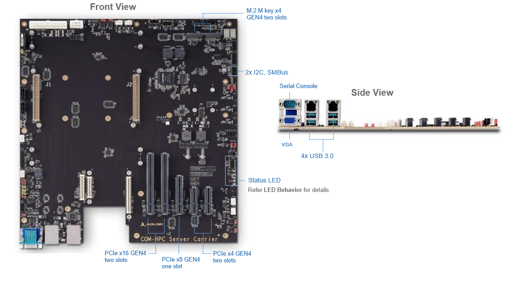
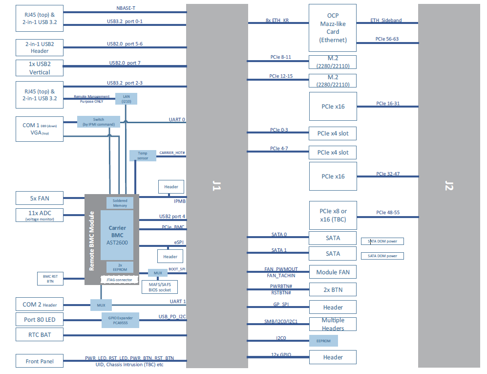
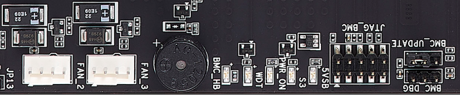

# AVA Developer Platform

## COM-HPC Server Base   

[Download Datasheet](https://hq0epm0west0us0storage.blob.core.windows.net/$web/public/COMe/Ampere/AVA/Documentation/AVA_Server_Base-datasheet-preliminary-20210907.pdf)

COM-HPC Server carrier is a general purpose carrier for generic COM-HPC server type modules typically used for prototyping purposes.

The carrier is an EATX size and can be mounted into standard EATX capable tower enclosures.

It is powered by off the shelve ATX type power supplies

 

### Summary of Interfaces

| PCIe slots               | Rear I/O                 | Aux Headers          |
| :----------------------- | :----------------------- | :------------------- |
| PCIe x16 GEN4  two slots | 4x USB 3.0               | *RS232               |
| PCIe x8 GEN4 one slot    | LAN GbE                  | 5x FAN power         |
| PCIe x4 GEN4 two slots   | LAN GbE (BMC management) | Front panel signals  |
| M.2 M key GEN4 two slots | Analog VGA               | *SPI, *GPIO          |
|                          | RS232 DB9                | 2x I2C, SMBus        |
|                          |                          | 2x SATA (not active) |

**Note**: Please wait for further releases

 

### Specifications
**Core Module Interface**

- PICMG COM-HPC Revision 1.0
- Support Server Type module in Size E or Size D form factor

**Dimension**

- 305 mm x 330 mm (Extended-ATX)

**Expansion Busses**

- 2 PCI Express x4 slot (PCIe lane 0-3, 4-7)
- 2 PCI Express x4 M.2 M key connector (PCIe lane 8-11, 12-15)
- 2 PCI Express x16 slot (PCIe lane 16-31, 32-47)
- 1 PCI Express x8 slot (PCIe lane 48-55) 

**POST LEDs**

- Onboard IO expander for BIOS POST code data, on I2C bus

**Secondary BIOS**

- Onboard socket for secondary SPI flash

**Connectors**

- Two x 400-pin (10mm height)

**OCP Mezzanie like Ethernet**

Three connector (A,B,C) on carrier on Rear side

- Connector C: 4x KR input (ETH 0-3) and support ADLINK OCP Mezzanie like Ethernet card
- Connector B: 4x KR input (ETH 4-7) and and support ADLINK OCP Mezzanie like Ethernet card

- Connector A: x8 PCIe lanes input (PCIe lane 56-63)

- NC-SI (from Carrier BMC) and support OCP Mezzanie 2.0 Ethernet card

**General Purpose LAN**

- 2500/1000/100/10BASE-T compatible RJ-45 on Rear I/O

- Note: 2500BASE-T depends on COM-HPC module

**Remote Management LAN**

- 1000/100/10BASE-T compatible RJ-45 on Rear I/O

- Source from the Carrier BMC

**Carrier BMC**

- Carrier BMC is for the out-of-band management (TBC)

**SATA**

- 2x SATA 

**USB**

- 4x USB 3.2/2.0/1.0 (USB 0-3) Type A connector on Rear I/O
- 2x USB 2.0 header (USB 5-6) for front panel usage (TBC)
- 1x USB 2.0 Vertical connector (USB 7) (TBC)

**Serial Port**

- 1x DB-9 (UART 0) on Rear I/O, 1x onboard 10-pin header (UART 1)

**VGA Port**

- 1x VGA on Rear I/O for development purpose
- source from the Carrier BMC

**FAN**

- 1x 4-pin FAN connector (source from COM-HPC module)
- 5x 4-pin FAN connector (source from the Carrier BMC)

**Feature Connectors**

- Headers for SMBus, 2x I2C, eSPI, GP_SPI, 12x GPIO, IPMB (source from the Carrier BMC)

- Header for front panel usage

- Jumpers for module control signals

**Miscellaneous**

- Power Button, Reset Button, status LEDs

  

   

### Preliminary Functional Diagram

### LED Behavior

 

| Label & Color   | Indication                                              |
| --------------- | ------------------------------------------------------- |
| 5VSB (Green)    | 5VSB of ATX power supply is ready                       |
| S3 (Blue)       | System is not in S0 mode                                |
| PWR_ON (Green)  | System is in S0 mode                                    |
| WDT (Red)       | Watch Dog timer (WDT) event                             |
| BMC_HB (Orange) | BMC heart beat (BMC_HB) Normal behavior of Carrier BMC) |

| System State | 5VSB LED | S3 LED | PWR_ON LED | BMC_HB LED |
| ------------ | -------- | ------ | ---------- | ---------- |
| S5           | Green    | Blue   | OFF        | Blink      |
| S0           | Green    | OFF    | Green      | Blink      |

 

