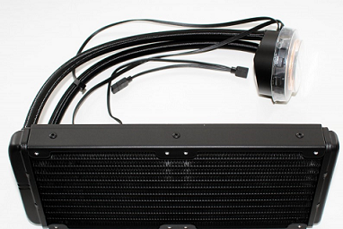

# Tower Enclosure

# Liquid Cooling Assembly

● Asetek  based all-in-one closed loop, maintenance free liquid cooling solution for Ampere Altra SOC

● All aluminum radiator with 11 water channels to disperse water and heat

● Thermally optimized cooling plate and low-noise pump design for high performance, quiet cooling

● Two 120 mm Vento ARGB fans

# ATX Power Supply

● 80 Plus Gold Certified 

● ATX Version : ATX 12V V2.52 

● Protection : OCP / OVP / UVP / OPP / SCP / OTP / NLO / SIP

● Certifications : CE / UKCA / CB / FCC (IC) / EAC / CCC / TUV / cTUVus / RCM / NOM / BSMI / KC

● PFC : 0.99

● Input Voltage : 100-240V

● Input Frequency : 47Hz-63Hz

● Noise Level @ 20% : 11.2dB(A), Noise Level @ 50% : 750W : 11.3dB(A), Noise Level @ 100% :  750W : 22.7dB(A)

● EPS 8 (4+4) Pin Connector  : 750 Watt

