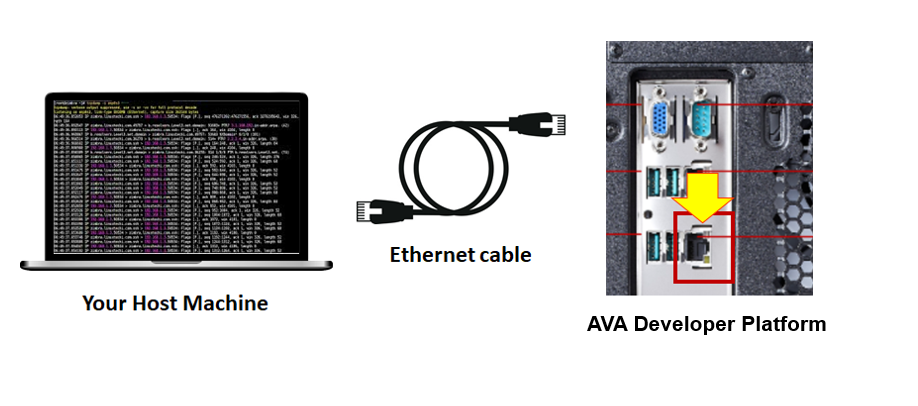
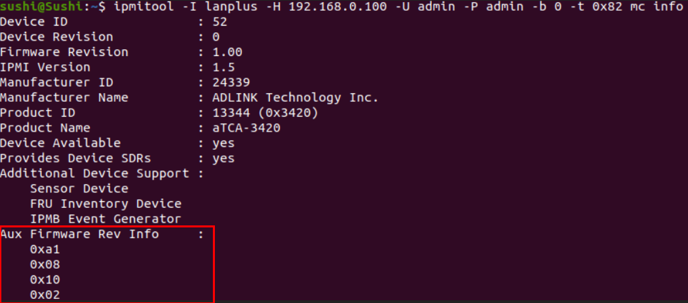

## How to Flash MMC Firmware Using Out-of-Band Management (OOBM)

The COM-HPC Altra module comes equipped with an MMC (Module Management Controller) that communicates with the BMC (Baseboard Management Controller) on the carrier board. The MMC provides power sequence control and hardware monitoring  (CPU temperature, voltage readings,etc ...). 

The below procedure describes how to update MMC firmware by connecting the the BMC through its Ethernet port by using IPMI commands.

Before starting, please prepare and Ethernet cable and connect to your host machine running Linux and the AVA Developer Kit

 

## If your host Machine runs Linux Environment 

- Configure the static IP Address on the network device and save it:

  - IP address: **192.168.0.22**

  - Netmask: **255.255.255.0**

  - Gateway: **192.168.0.200**

    

##  If your host Machine runs Windows Environment

- Configure the static IP Address on the network device and save it:

​       

- the IP address of OOBM on SCDP system is **192.168.0.100**

- type the Ping command to see if the connection is alive

   ```
   $ ping 192.168.0.100
   ```

   output should look like this

   PING 192.168.0.100 (192.168.0.100) 56(84) bytes of data.
   64 bytes from 192.168.0.100: icmp_seq=1 ttl=64 time=0.569 ms
   64 bytes from 192.168.0.100: icmp_seq=2 ttl=64 time=0.572 ms
   64 bytes from 192.168.0.100: icmp_seq=3 ttl=64 time=0.560 ms

- below command  lists the MMC version: 

  ```
  $ ipmitool -I lanplus -H 192.168.0.100 -U admin -P admin -b 0 -t 0x82 mc info
  ```

   There are 3 bytes that define the version on Aux Firmware Rev Info: 

  - 0xa1  ( please ignore this byte)

  - 0x08 

  - 0x10

  - 0x02


-  Command to upgrade the firmware: 

  `ipmitool -I lanplus -H 192.168.0.100 -U admin -P admin -b 0 -t 0x82 hpm upgrade hpm1all_081002.img activate force`

​           Note:

​                 - **hpm1all_081002.img** is the firmware file to be flashed

​                 - click [here](https://hq0epm0west0us0storage.blob.core.windows.net/$web/public/COMe/Ampere/SCDP/MMC_FW/hpm1all_081002.img) to download the latest MMC FW image (081002 version)


**Once upgrade successfully, please check the "Aux firmware Rec info" is the latest one.**

​    
