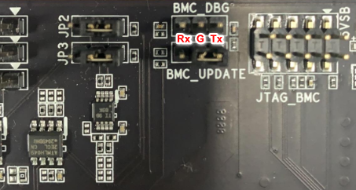

# How to connect BMC serial console on AVA Developer Platform

There is 3 Pin header (**BMC_DBG**) on the carrier board that supports the serial console for BMC (with IPMI functions).

 Before start, please prepare **USB to TTL Serial Adapter 3.3V Debug Cable TX RX Signal 3 Pin** like this:

* Plug the USBtoRS232 adapter cable to your host machine and connect 3 pins with the corresponding the pins.

  ### If your host machine is runs Linux Environment

  -  Type this command to list the USB devices: **lsusb**

     > sushi@Sushi:~$ lsusb
     > Bus 002 Device 001: ID 1d6b:0003 Linux Foundation 3.0 root hub
     > **Bus 001 Device 011: ID 0403:6001 Future Technology Devices International, Ltd FT232 Serial (UART) IC**

  -  once detected, the devices will be under the /dev/ path to see if the interface is visible with this command: **ls /dev/ttyUSB0**

  - If you are installing a Minicom serial device then follow the below procedure:

    > sudo apt-get install minicom
    >
    > sudo minicom -s

    - Go to **[Serial Port Setup] **in the Configure of minicom application
    - **Press A** and then edit to **/dev/ttyUSB0**
    - **Press E** and then edit to **115200 8N1**
    - Go to **[Exit] **

  - Then power on  target system and you will get the booting messages from Serial Console

    ### 

    ​

    ### If your Host machine runs Windows Environment

- The common terminal software is putty. 

- Putty is for free to [download](https://www.chiark.greenend.org.uk/~sgtatham/putty/latest.html).

- After executing it, please configure the following parameters

- Select Connection type to **Serial**.

- Modify Serial line to the COM port which is found in the device manager.

- Set Speed to **115200**.

- Click **Open** button to enter serial console

   

- After successful set up, you can see the logs from serial console and please use the credentials to login 
  - **Username: sysadmin**
  - **password: superuser**

​    