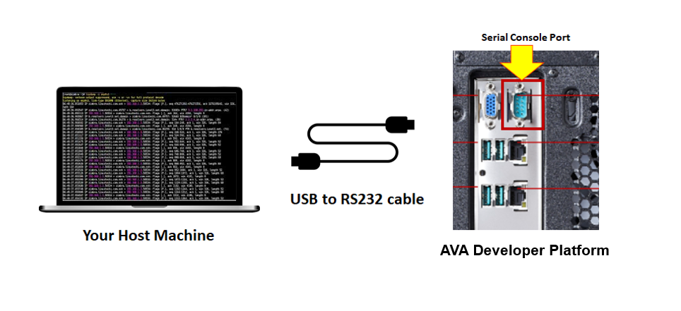
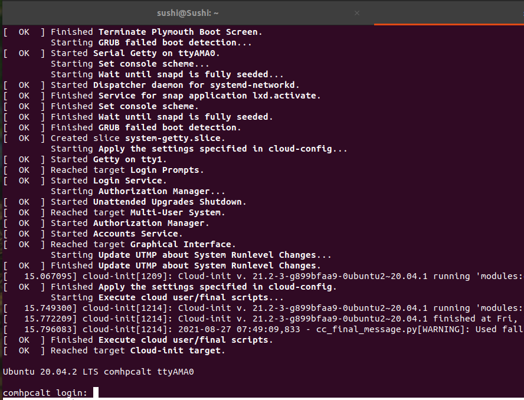
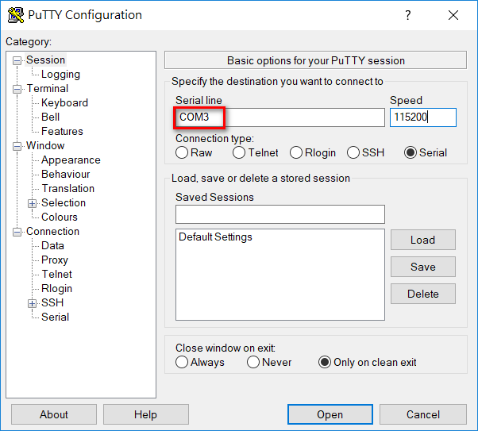

# How to use Serial Console

By default, the EDK II is configured to use the serial console and the booting messages can also be output. Before starting the procedures, please prepare **USB to RS232 Female DB9 Serial Converter Cable** in advance.

Plug the **USBtoRS232 adapter cable** to your host machine & AVA Developer platform

## If your host machine is Linux Environment

- Type this command to list the USB devices: **lsusb**

  > sushi@Sushi:~$ lsusb
  > Bus 002 Device 001: ID 1d6b:0003 Linux Foundation 3.0 root hub
  > **Bus 001 Device 011: ID 0403:6001 Future Technology Devices International, Ltd FT232 Serial (UART) IC**

- Once detected, the devices will be under the /dev/ path to see if the interface is visible with this command: **ls /dev/ttyUSB0**

- If you are installing a Minicom serial device then you would do the following:

  > sudo  apt-get install minicom
  >
  > sudo minicom -s

  

  - Go to **[Serial Port Setup]** in the Configure minicom application
  - **Press A** and then edit to **/dev/ttyUSB0**
  - **Press E** and then edit to **115200 8N1**
  - Go to **[Exit]**

   

- Then power on AVA Developer Platform and you will get the booting messages from Serial Console

  

  

## If your Host machine is Windows Environment

- The common terminal software is putty. Putty is for free to [download](https://www.chiark.greenend.org.uk/~sgtatham/putty/latest.html).

- After execute it, please configure the following parameters

- Select Connection type to **Serial**.

- Modify Serial line to the **COM port** which is found in the device manager

- Set speed to **115200**.

- Click **Open** button to enable the serial connection through Putty in Windows host

  

