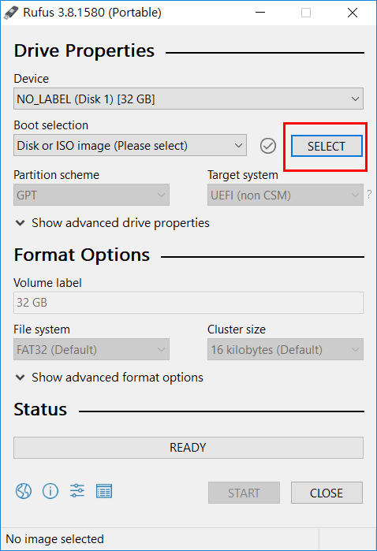
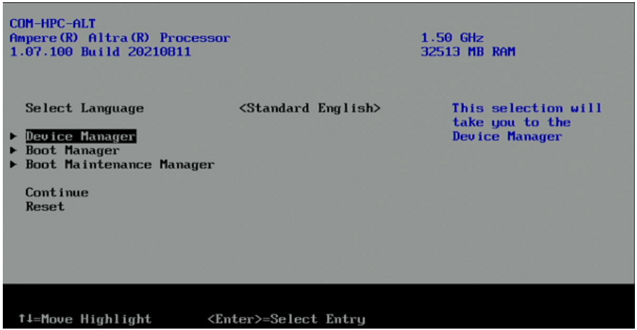
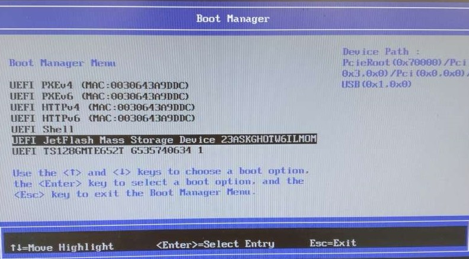
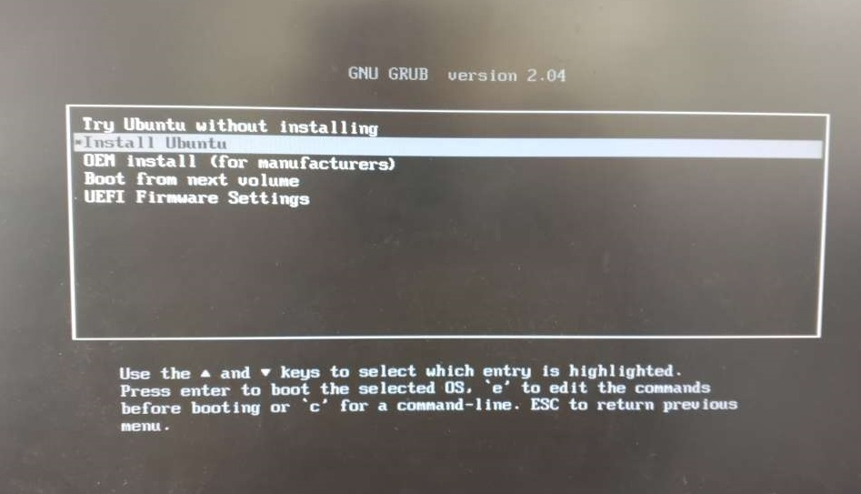

# Ubuntu 20.04.3 LTS Installation on AVA Developer Platform

<div class="bullets">

## Binary Image Download Link

- Ubuntu 20.04.3 OS [click here](https://ubuntu.com/download/server/arm)

Boot the system with the USB drive or M.2 PCIe card


### Prerequisites

- Download the Ubuntu OS
- If you are Windows user, download Rufus as flashing tool [click here](https://rufus.ie/en/)
- If you are Linux user, you can use dd command to flash the image into USB drive


### Windows Host

- Insert an empty USB drive into the development host and execute rufus.exe as the picture below. It will auto-detected your storage drives.
- Press the **SELECT** button and browse to the .img file downloaded in your working directory on the development host. Then click **START** and wait for the process to be finished





### Linux Host

- Download the bootable Ubuntu OS to the working directory on your development host. Insert an empty USB drive into the development host and enter the following command to flash into the USB drive


**Warning**: Make sure you first properly identify the USB device name as for example /dev/sdb or /dev/sdc. Data loss may result if written to the wrong device or in the worst case you kill your host OS.

```
$ sudo dd if=[your image].img of=/dev/sd[x]
```
- After dd has completed, enter the following command: 

```
$ sync
```


### Booting from USB

- Once the OS is flashed into USB, plug the USB to the target and power on


- Enter boot menu by continuous clicking on ESC button
- After entering into boot manager, select the USB drive to boot from it
- Refer the below screenshots for your reference










## Supported Features and Interfaces


- Linux kernel version: 5.10.35
- 2x USB 2.0 on Front I/O
- 6x USB 3.0 on Rear I/O
- LAN GbE on rear I/O
- LAN GbE on rear I/O for BMC management
- PCIe x16 GEN4 two slots, PCIe x8 GEN4 one slot, PCIe x4 GEN4 two slots & M.2 PCIe x4 GEN4 two slots
- VGA compatible with 1080p
- RS232 DB9 on rear I/O
- Serial console through VGA

</div>