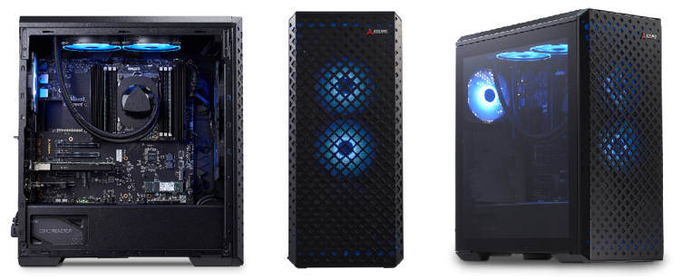

# What’s inside the box

Before going to the setup or installation chapter, please verify the contents of your package. The following items should be part of the AVA Developer Platform. The standard set includes the following items:

**1. AVA Developer platform**

  - COM-HPC Altra server type module with Ampere Altra 32 core SoC
  - COM-HPC Server Base carrier board
  - Intel Quad X710 10GbE LAN card
  - USB 3.0 card for front panel
  - 32 GB DDR4 system memory
  - 128 GB NVMe M.2 storage
  - Tower enclosure
  - Liquid cooling assembly
  - 750W power unit

**2. The additional items**  

* Power cord [EU/US]
* Power cables for PCIe cards

