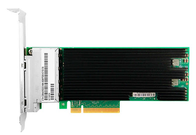
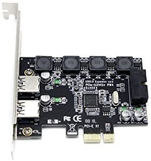

# AVA Developer Platform

## System Components

- COM-HPC Altra server type module with Ampere Altra 32 core SoC
- COM-HPC Server Base carrier board
- Intel Quad X710 10GbE LAN card
- USB 3.0 card for front panel
- 32 GB DDR4 system memory
- 128 GB NVMe M.2 storage
- Tower enclosure
- Liquid cooling assembly
- 750W power unit

## Front Panel Operation and Interfaces

 

### Icons and ports

#### USB 3.0 x2
The USB front panel are connected to the PCIex1 USB card

#### Hybrid Audio Port
It is not active, this system does not support Audio

#### LED Button
For your entertainment during coding you can switch on the color mode of the 5 ARGB system fans in the enclosure. There are 12 color preset modes and an off mode. Pressing this button cycles you through the preset modes.

#### Power Button

Systems are configured for ATX mode operation. See **"Power up/down and ACPI behavior"** below for particularities booting up and shutting down

 

## Rear I/O and Power Supply

 

## Power up/down and ACPI behavior

#### Master switch on the power supply

Switch on power input to the system on the rear side of the system. This will energize the system but will not let it boot up.

 

#### ATX mode power on with power button on front panel

Power button needs to be pushed for 2 seconds and than released than system will boot up

 

#### ATX mode power down with power button on front panel

Power button needs to be pushed for 2 seconds and than released than system will shutdown power

This does not sends a signal to the OS to do an orderly OS shutdown and than OS issue a poweroff !!!

Instead pressing this button during operation leads to sudden hard power off

 

#### Reset or reboot

It does not work at this time. SOC deliver unreliable RESET information so we had to shut it down. There is no hard reset and no soft reset.

A soft reset under Linux with command "sudo reboot" leads to a hanging system that can only be recovered by :

- Hard power down on the switch located on the power supply
- Power back on using the switch located on the power supply
- Press "Power Button" on the front panel for 2 secs and release

The edk2 UEFI menu option RESET has the same result.

Note: Cannot operate the system remotely. In remote case if you do a "sudo reboot" the system will just hang and not do the warm reboot

 

## Quad 10GBASE-T LAN card

- Intel Ethernet Controller XL710

- 4x 10GBase-T RJ45 Standard

- Intel Ethernet Controller XL710

- Cat6a Cabling with RJ45 Connectors up to 100 meters

- Auto-negotiation between 100Mb/s, 1GbE and 10GbE PCIe 3.0 x8

 

## USB 3.0 Card for Front panel 

- NEC / Renesas D720201 chipset card

- Supporting 4 USB 3.0 connection totally

  - 2x back USB 3.0 ports

  - 1x 20-pin USB 3.0 header  supporting up to 2 USB 3.0 on front pane

    

