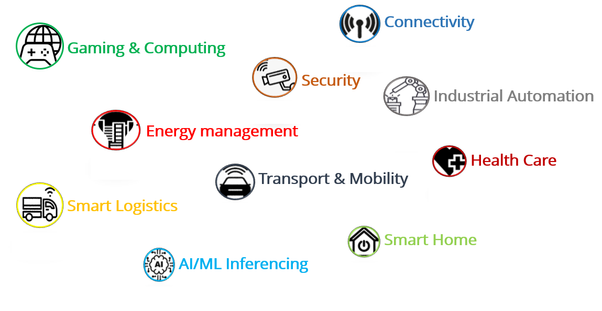

<div class = "bullets">

## Welcome to the era of Artificial Intelligence!!!

You most likely do not see AI at work, but it is almost everywhere these days. Man-made machine intelligence is making a huge difference. Within this decade, machine reasoning has gone from a sci-fi dream to a basic piece of our regular day-to-day existence. We use AI frameworks to communicate with our phones through Siri and Alexa, vehicles like Tesla's decipher and examine their environmental factors to drive themselves, Amazon screens our perusing propensities and cleverly serves us up items it thinks we'd prefer to purchase, and even Google and YouTube chooses what sorts of query items we need. This is just the start, and one day we will glance back at AI and wonder about how it made our lives so easy and comfortable. 

## **Accelerating the time for work**

However, what precisely is AI? Possibly a superior question may be what precisely is "Intelligence"? The most straightforward answer is gathering information about the world, and utilizing that information to make expectations and react in the short and long run. That applies to individuals and machines. Therefore, when we talk about AI in our lives, we are looking at everything from a PC having the option to read the handwritten text and transfer it to machine ASCII code and maybe even then to understand the context, to a huge database showing your preferred options in advance on the web, to a robot performing complex medical procedures all alone. Since the universe of AI is so fantastically enormous, everybody should look into the advancements in their fields.

## Artificial Intelligence on Modules (AIOM)

AIOM allows quick creation of Edge AI systems. ADLINK technology launched a new range of modules for artificial intelligence (AI) at the edge, allowing inference much faster than traditional methods with I-Pi SMARC IMX8M Plus. This AIOM product is created with ADLINK's I-Pi SMARC and NXP's eIQ machine learning software which uses Neural processing unit (NPU) for AI inferencing.

The Features include:

- Optional in-SoC 2.3 TOPS NPU
- SMARC revision 2.1.1 compliant
- NXP i.MX8M Plus with Quad Cortex-A53
- LVDS, DSI, HDMI graphic output interfaces
- Dual CAN bus / USB 2.0 / USB 3.0 interfaces
- Dual GbE ports (one TSN capable)
- I2S audio codec interface
- Rugged operating temperature (optional): -40°C to +85°C
- 15 year product availability

## eIQ Machine learning Software

Machine learning is a method of data analysis that automates analytical model building. It is a branch of artificial intelligence based on the idea that systems can learn from data, identify the patterns and make decisions with minimal human intervention.

<center>
 
</center>


The major benefits of this software is edge inference and intelligence, No cloud dependency, privacy and better user experience. In 2010[1], the so-called deep learning started. It is a fast-growing subdomain of ML, based on Neural Networks (NN). Inspired by the human brain, deep learning achieved state-of-the-art results in various tasks. Neural networks are capable of learning complex patterns from millions of examples. A huge adaptation is expected in the embedded world where NXP created eIQ machine learning software for i.MX applications processors, a set of ML tools which allows developing and deploying ML applications on the i.MX 8 family of devices.

eIQ software acts as the bridge between NN and Arm machine learning processors that supports the Arm NN SDK which supports Caffe, TensorFlow, TensorFlow Lite and ONNX models. This software development provides a set of libraries and development tools for machine learning applications. eIQ software is solely responsible for inferencing the trained models. For more details about eIQ machine learning software, please refer official NXP webpage https://www.nxp.com/design/software/development-software/eiq-ml-development-environment/eiq-software-for-arm-nn-inference-engine:eIQArmNN

The below figure describes the block diagram of eIQ software for Arm NN SDK

<center>
 
</center>


### AI innovations based on daily life

AI has even appeared to guess human conduct, and foresee cautioning signs by perceiving basic language utilized by individuals in social sites and making law authorization aware of such actions. On the other hand, that equivalent innovation can be utilized to find potential disasters, or deliver news and alerts to the public. The more we examine and create human-like consciousness, the clearer it turns into this hugely amazing asset for a lot of companies. 

As futurists attempt to design out a quickly changing and propelling world, the greatest obstacle is neither the innovative, nor financial and political. It is the pace of the changes that are coming up with the introduction of new capabilities and improvements of the inference model. Only an imposing business model of the futureproof computer on modules can be responsible to control the most recent achievements in information gathering, handling, and managing daily needs in the world such as ATMs, Ticket vending machines, surveillance network, etc. Keeping in mind that we may trust that AI will help advance our public, we need hardware that could support this kind of software requirements.


<center>
 
</center>

In recent days, Artificial intelligence is created by engineers for performing organized tasks with supervised learning. Its purpose is to handle the allotted task without any self-thinking. It is good at speech and Image recognition and playing a few games. Machine learning makes the computer or machines to think as humans do. It is like the learning of newborn babies that starts with zero but improves with data intake. The computer grasps knowledge with a neural network. It learns to analyze the situation with predictions. The world is full of data with visuals and sounds. AI evolves with analytical, logical, and creative thinking. 

### Target Applications:

• **Smart home:** AI local server, alarm hub and security systems, smart robot, access, control, home patient monitors, sound bars, AV receivers, and other home automation applications 

• **Smart city:** safety and security, surveillance, crowd and traffic control, transportation and fleet management 

**• Smart world:** smart retail, POS interfaces, targeted advertisement, building control, teleconferencing systems and healthcare diagnostics 

**• Industrial IoT:** machine vision, robot controller, industrial gateway, HMI and computers, commercial printers and scanners, industrial tablets, smart industrial cameras and multiple factory automation applications

### Transfer Learning

Before taking a deep dive in Transfer Learning, we need to understand what inference are available in Arm NN SDK and why we need them. However, the complications occur in storing and compiling the large data on the local computers. Even if we use cloud or edge servers to manage the data, still the training and building the model becomes difficult. The new revolution in technology has gifted inference engines with various designated processing units such as GPU’s, NPU’s, VPU’s and TPU's etc, which could be the solution that engineers in embedded world are looking for. 

One does not need to train or build those AI models, Inference engines could replace this time taking tasks and give better performance than those traditional training models. The impressable aspect of these inference engines is that they are compatible with Arm processors and don’t require much storage space and time, yet they give better performance. Usually, when you build an AI model, there are few specific rules to be followed. Such as setting up the environment, supporting framework and its respective packages and dependencies, and then compiling them together. The general pipeline of deploying AI models follows the procedure such as Data Ingestion, Data Filtering, Model Training, Model Testing, and finally Model Deployment. Usually, for an AI environment, there are approximately 800+ tools/frameworks/libraries. 

But most of the developers prefer well-known frameworks such as Caffe, TensorFlow, PyTorch, ONNX, etc. If we keep on installing the AI libraries on embedded devices manually, it takes a lot of time, space, and also finding the correct source for the required package could be a challenging task. So, this whole process is just to make the application work, still more effort to optimize it. Therefore nowadays Industrial manufacturers and developers prefer ready environments, as they focus on application development rather than research. Henceforth, the inference engines are calibrated to make this complex procedure much easier where users can develop their applications from pre-trained models without considering all the background tasks. This makes the hardware compatible with software for a longer time and reduces the cost for the Industry. The below picture explains the Neural network runtime architecture (NNRT) [1]. 


<center>
 
</center>


So far we have understood how the inference engines are supporting the NPU inferencing in eIQ machine learning software. Transfer learning is a machine learning method where a model is developed for a task reused as the initial point on the second task. It is one of the popular approach and time saving method where pre-trained models are used as the initial point to follow up with the second task.

#### When to use Transfer Learning?

Transfer Learning is an optimization, a shortcut to saving time or getting better performance. In general, it is not obvious that there will be a benefit to using transfer learning in the domain until after the model has been developed and evaluated. For example, The knowledge gained while learning to recognize birds can also used to recognize vehicles, animals etc. The point is you are replacing the data of initial task and retraining the parameters making the model to adapt to perform the second task. For more details refer this link [2] https://community.nxp.com/t5/eIQ-Machine-Learning-Software/eIQ-Sample-Apps-Overview/ta-p/1122925

Also check our Tutorials about how to use Transfer Learning (insert the link for tutorials)

## Use Cases and Benchmark

For better understanding on NPU inferencing on I-Pi SMARC IMX8M Plus, results of use cases are tabulated for easy understanding.
<center>
<div  class="table-wrapper" markdown="block">

| SI.No |             Model             |            Algorithm             | Inference Engine | NPU Inferencing(ms) | CPU Inferencing(ms) |
| ----- | :---------------------------: | :------------------------------: | :--------------: | :-----------------: | :-----------------: |
| 1     |  Facial Expression detection  |            MobileNet             |   Tflite 2.3.0   |         35          |         98          |
| 2     |     Image Classification      |            MobileNet             |   Tflite 2.3.0   |          5          |         36          |
| 3     |       Object detection        |   Single Shot detection (SSD)    |   Tflite 2.3.0   |        10.25        |         41          |
| 4     |       Object detection        |    Deep Neural Network (DNN)     |   OpenCV 4.2.0   |         56          |        123.6        |
| 5     | Fire & No fire Classification | Convolution Neural Network (CNN) |      ArmNN       |         7.6         |        42.8         |
| 6     |      OpenPose detection       |            MobileNet             |   Tflite 2.3.0   |         48          |         118         |
| 7     |       Object detection        |             YOLO v3              |   Tflite 2.3.0   |         102         |         225         |

The above histogram clearly shows the difference of NPU and CPU inferencing on I-Pi SMARC IMX8M Plus

</div>

</center>


<center>
 
</center>


## Netron

Netron is a viewer for neural network, deep learning and machine learning models. Netron supports **ONNX** (`.onnx`, `.pb`, `.pbtxt`), **Keras** (`.h5`, `.keras`), **TensorFlow Lite** (`.tflite`), **Caffe** (`.caffemodel`, `.prototxt`), **Darknet** (`.cfg`), **Core ML** (`.mlmodel`), **MNN** (`.mnn`), **MXNet** (`.model`, `-symbol.json`), **ncnn** (`.param`), **PaddlePaddle** (`.zip`, `__model__`), **Caffe2** (`predict_net.pb`), **Barracuda** (`.nn`), **Tengine** (`.tmfile`), **TNN** (`.tnnproto`), **RKNN** (`.rknn`), **MindSpore Lite** (`.ms`), **UFF** (`.uff`).

Netron has experimental support for **TensorFlow** (`.pb`, `.meta`, `.pbtxt`, `.ckpt`, `.index`), **PyTorch** (`.pt`, `.pth`), **TorchScript** (`.pt`, `.pth`), **OpenVINO** (`.xml`), **Torch** (`.t7`), **Arm NN** (`.armnn`), **BigDL** (`.bigdl`, `.model`), **Chainer** (`.npz`, `.h5`), **CNTK** (`.model`, `.cntk`), **Deeplearning4j** (`.zip`), **MediaPipe** (`.pbtxt`), **ML.NET** (`.zip`), **scikit-learn** (`.pkl`), **TensorFlow.js** (`model.json`, `.pb`).

### How to install Netron

**Linux:** Run the below command in your terminal

```python
$ snap install netron
```

**Windows:** Run the below command in your cmd

```python
$ winget install netron
```

### **Why is Netron important?**

Being a viewer for neural networks and machine learning models, it generates beautiful visualizations that you can use to clearly communicate the structure of your neural network. What’s more, using the tool, you can explore your models in great detail. And best of all, it’s a cross-platform tool. During transfer learning, Netron helps to analyze the input parameters of the network which can helpful during retraining in transfer Learning. The below figure describes an example of the network visualizer. 

<center>
 
</center>

## Future innovation


<center>
 
</center>

I-Pi SMARC IMX8M Plus can be used for various applications such as gaming & computing, connectivity, security, industrial automation, energy management, health care, transport & mobility, smart logistics, smart home and AI/ML inferencing.

### Demos 

<center>
<iframe
    width="700"
    height="480"
    src="https://www.youtube.com/embed/WkdLgFr4_hw"
    frameborder="0"
    allow="autoplay; encrypted-media"
    allowfullscreen
>
</iframe>
</center>

<center>
<iframe
    width="700"
    height="480"
    src="https://www.youtube.com/embed/0a_iCahPTmE"
    frameborder="0"
    allow="autoplay; encrypted-media"
    allowfullscreen
>
</iframe>
</center>


<center>
<iframe
    width="700"
    height="480"
    src="https://www.youtube.com/embed/0TG4vyJSRY4"
    frameborder="0"
    allow="autoplay; encrypted-media"
    allowfullscreen
>
</iframe>
</center>


## Reference:

[1] Source: User guide https://www.nxp.com/design/software/development-software/eiq-ml-development-environment/eiq-software-for-arm-nn-inference-engine:eIQArmNN

[2] https://community.nxp.com/t5/eIQ-Machine-Learning-Software/eIQ-Sample-Apps-Overview/ta-p/1122925


</div>

<style>
.bullets ul li {
    list-style-type: disc;
 }
 .bullets ol li {
    list-style-type: decimal;
 }
 .table-wrapper {
  overflow-x: scroll;
}
</style>


