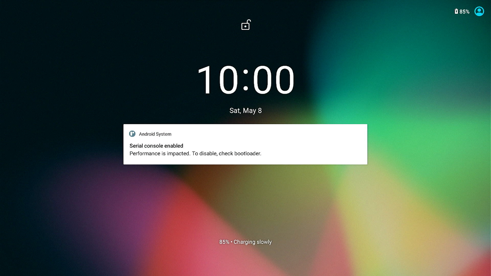

Android 11 Image with Wayland Desktop Environment
===

## Binary Image download Link

- The latest Image of Android 11 image: (size of compressed file: 688 MB):[click here](https://hq0epm0west0us0storage.blob.core.windows.net/%24web/public/SMARC/LEC-iMX8MP/Images/Android/LEC-IMX8MP-2G-IPi-SMARC-PLUS_Android11_1v0_20210607.zip).
- All Versions: <a data-toggle="collapse" data-target="#demo" href="#">click here</a>.
  
    
<iframe class="download-area" src="https://hq0epm0west0us0storage.z22.web.core.windows.net/?prefix=public/SMARC/LEC-iMX8MP/Images/Android/&amp;pageLevel=0" scrolling="no">
      	</iframe>

    

## Android 11

Boot up the system by flashing Image from the SD card/eMMC, you will see the following screen:

**Note**:

 1. Please find the description of how to flash an image to the SD card  [here](HowToFlashImageSD.html#Flash-Yocto-or-Android-Image).

 2. Please find the description of how to flash an image to the eMMC  [here](HowToFlashImageeMMC.html).

 3. Make sure the boot loader on the carrier board is set according to the SD card or eMMC as you boot.

    

### Android supported features & interfaces 

*  Linux kernel version 5.10.35
*  Supports H.265, H.264, MPEG-4, VP8, and VC-1 video codec with up to 1080p60fps.
*  2D / 3D Graphics Acceleration which supports Wayland.
*  4x USB 2.0 ports.
*  2x 10/100 Mb LAN ports.
*  HDMI output with resolution 1920x1080@60Hz.
*  Audio & speaker.
*  USB OTG support ADB Shell.
*  CAN FD Bus interface.
*  [40 Pin expansion header](UserInterfaces.html) with UART, I2C, SPI, GPIO and PWM support.
*  [MicroG ](https://microg.org/) service support: Providing the functionality required to run apps that use Google Play Services.
*  Raspberry Pi Camera V2.1 (2 Lanes) - SONY iMX219 sensor ([Datasheet](https://www.raspberrypi.org/documentation/hardware/camera/)).

