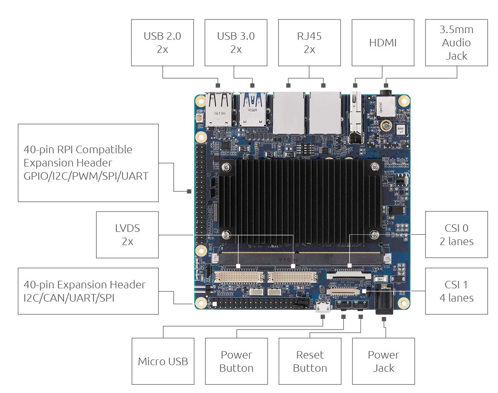
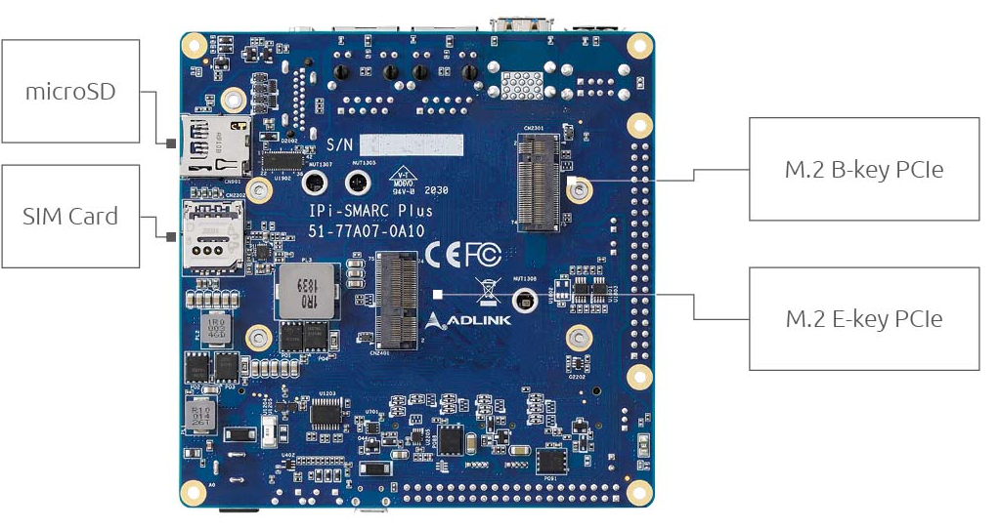

LEC-IMX8MP SMARC 2.1.1 module with I-Pi SMARC Plus Carrier Board
===

Industrial Prototyping Kit for IoT/AIoT with Off-the-Shelf SMARC Computer-on-Module

SMARC 2.1.1 Carrier Board with M.2 Extension.

[Download Datasheet](https://hq0epm0west0us0storage.blob.core.windows.net/$web/public/SMARC/LEC-iMX8MP/documentation/I-Pi-SMARC-IMX8M-Plus-datasheet-20210427.pdf)

 

### **Features**

*	Equipped with SMARC 2.1.1 compliant, specially designed for
industrial embedded applications requiring long life, high MTBF and
strict revision control
* Includes everything needed to go live in minutes
* Industrial grade quality and 15 year product availability
*  Supports Android, Ubuntu and Yocto OS
 

### **Specifications**

#### Graphics and Camera

​	1x HDMI 1.4b / 2.0b 

​    1x eDP 1.3 (bom option) 

​    1x MIPI-DSI 4 lanes  

​    1x MIPI-CSI dual lane interface  

​    1x MIPI-CSI quad lane interface 

#### **Audio**	 

​    Interchangeable audio codec connector with I2S and HDA signals 

#### **Dual Ethernet**	 

​    1x 10/100/1000 RJ45 connector 

​    1x 10/100/1000 RJ45 connector 

#### **Expansion Busses**	 

​     2x USB 3.0, 2x USB 2.0, 1x USB 2.0 OTG connectors 

​     4x UART interfaces SER2 (TX/X/CTS/RTS) and SER0, SER1, SER3 (TX/RX) 

​     2x CAN 2 interface pin headers 

​     2x SPI pin headers 

​     1x I²S interface to audio interface  

​     2x I²C interface on pin header 

​     14x GPIO with interrupt on pin header

​      M.2 B-key and M.2 E-key expansion slots for additional storage or communication

​      Micro SD card slot

​      SIM card slot

#### **Storage**	 

​      1x SDIO (4-bit) compatible with SD/SDIO standard, up to version 3.0 

#### **Power** 

​      19Vdc input via barrel connector 

#### **Mechanical and Environmental**	 

​      Form Factor: SGET SMARC Specifications 2.1 

​      Dimensions: 110 mm x 110 mm 

​      Operating Temperature:	

​            Standard: 0°C to +60°C 

​            Rugged: -40°C to +85°C (optional) 

​       Humidity:

​            5-90% RH operating, non-condensing 

​            5-95% RH storage (and operating with conformal coating) 

​       Shock and Vibration:	

​            IEC 60068-2-64 and IEC-60068-2-27, MIL-STD-202 F,  

​            Method 213B, Table 213-I, Condition A and Method 214A,  

​            Table 214-I, Condition D 

​        HALT			

​             Thermal Stress, Vibration Stress, Thermal Shock and Combined Test 

### **Block Diagram** 

 

