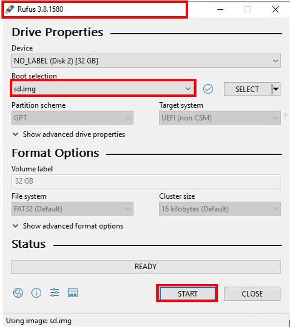
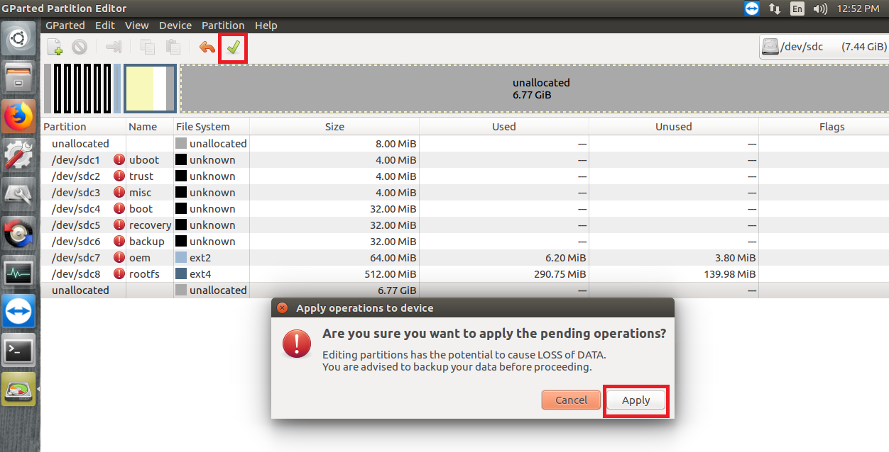

## How to Build Debian

<div class = "bullets">

This procedure describes how to create a Debian SD Card image for **LEC-IMX8MP with Industrial I-Pi SMARC**. The version of Debian used is 10 (buster).

## Recommended Hardware

To setup the build environment for Debian image creation, a Linux host with the following configuration is recommended. A host machine with adequate processing power and disk space is ideal as the packages can run several GBs in size and the build can take a lot of time.

- Intel Core-i7 processor (>= 4 cores)
- 8 GB RAM
- 1 TB disk space
- High speed network connectivity
- OS: Ubuntu 20.04 LTS

Update apt repositories list on your host machine.

```
$ sudo apt update
```

Install kernel and u-boot dependencies.

```
$ sudo apt-get install git-core gnupg flex bison gperf build-essential zip curl
zlib1g-dev gcc-multilib g++-multilib libc6-dev-i386 lib32ncurses5-dev
x11proto-core-dev libx11-dev lib32z1-dev ccache libgl1-mesa-dev libxml2-utils
xsltproc unzip device-tree-compiler liblz4-tool libssl-dev
```

Install buildroot dependencies.

```
$ sudo apt-get install libfile-which-perl sed make binutils gcc g++ bash patch gzip
bzip2 perl tar cpio python unzip rsync file bc libmpc3 git repo texinfo pkg-config cmake
tree texinfo
```


## Getting Started

The procedure below replaces the buildroot rootfs with the Debian one.

- Step 1: Create a Debian root file system.
- Step 2: Generate Buildroot SD Card Image.
- Step 3: Flash Buildroot SD card image to the prepared SD card by using SD Firmware Tool.
- Step 4: Replace the buidroot rootfs image with Debian’s one on BuildRoot SD Card image.

These steps are detailed below.

## Step 1: Preparing Debian Root File System

1. Create a new working directory and change directory into it.

   ```shell
   $ mkdir $HOME/imx8mp
   $ cd $HOME/imx8mp
   ```

2. Create a rootfs directory.

   ```shell
   $ mkdir rootfs
   ```

3. Install deboot strap and it's dependencies.

   ```shell
   $ sudo apt install debootstrap binfmt-support qemu-user-static
   ```

   ```shell
   $ sudo debootstrap --arch=arm64 --include=sudo,net-tools,isc-dhcp-client --foreign buster rootfs
   ```

4. Add required apt repositories to sources.list.

   ```shell
   $ sudo bash -c "printf 'deb http://deb.debian.org/debian buster main contrib non-free\ndeb-src http://deb.debian.org/debian buster main contrib non-free\n\ndeb http://deb.debian.org/debian-security buster/updates main contrib non-free\ndeb-src http://deb.debian.org/debian-security buster/updates main contrib non-free\n\ndeb http://deb.debian.org/debian buster-updates main contrib non-free\ndeb-src http://deb.debian.org/debian buster-updates main contrib non-free\n\ndeb http://deb.debian.org/debian buster-backports main contrib non-free\ndeb-src http://deb.debian.org/debian buster-backports main contrib non-free\n' > rootfs/etc/apt/sources.list"
   ```

### Configure the Rootfs

1. Add host name to `/etc/hostname` 

   ​	Here is an example.

   ```shell
   $ sudo bash -c "echo 'adlink' > rootfs/etc/hostname"
   ```

2. Add host entry in `/etc/hosts`

   ```shell
   $ sudo bash -c "printf '127.0.0.1\tlocalhost\n127.0.1.1\tadlink\n\n' > rootfs/etc/hosts"
   ```

   ```shell
   $ sudo bash -c "echo 'root::0:0:root:/root:/bin/bash' > rootfs/etc/passwd"
   ```

3. Prepare QEMU

   ```shell
   $ sudo wget https://github.com/multiarch/qemu-user-static/releases/download/v4.2.0-6/qemu-aarch64-static -O rootfs/usr/bin/qemu-aarch64-static
   $ sudo chmod +x rootfs/usr/bin/qemu-aarch64-static
   ```

4. Get your network ready

   ```shell
   $ sudo cp /etc/resolv.conf rootfs/etc/
   ```

5. Mount the proc sys dev file systems

   ```shell
   $ for f in proc sys dev dev/pts; do sudo mount --bind /$f rootfs/$f; done
   ```

6. Change root.

   ```shell
   $ sudo chroot rootfs /bin/bash
   ```

7. Add user name

   ```shell
   $ /debootstrap/debootstrap --second-stage
   $ apt install sudo net-tools isc-dhcp-client
   $ adduser imx8mp (provide new password and name for the user in the prompt)
   $ usermod -a -G sudo imx8mp
   ```

8. Install the required tools or utilities

   ```shell
   $ apt update
   $ apt install vim git sudo net-tools ifupdown kmod iputils-ping man wget bash-completion alsa-utils apt-utils usbutils i2c-tools netplan.io vnc4server lm-sensors build-essential cmake  can-utils mesa-utils blueman locales 
   ```
   
9. Configure locales

    You will be prompted through GUI menu to make certain selections such as those for date/time/region. Please make the appropriate selections and proceed.

   ```shell
   $ dpkg-reconfigure locales
   ```

10. Install xfce desktop

    ```shell
    $ apt install task-xfce-desktop
    ```

11. Exit from chroot

     ```shell
    $ sync
    $ exit
    ```


### Add I/O Drivers to Rootfs

#### - Ethernet & CAN Bus

1. Create a directory to copy the Ethernet and CAN kernel modules

   ```shell
   $ sudo mkdir $HOME/imx8mp/rootfs/home/imx8mp/rockchip_test
   ```

2. Please click [here](https://hq0epm0west0us0storage.blob.core.windows.net/development/LEC-PX30/Images/Debian/DebianNecessaryFiles/Kernel-modules.zip) to download and copy **smsc9500.ko, smscusbnet.ko and mcp25xxfd.ko kernel modules** into rockchip_test folder from host PC.

   ```shell
   $ sudo cp <your_path>/*.ko $HOME/imx8mp/rootfs/home/imx8mp/rockchip_test/
   ```

#### - Audio

1. Please click [here](https://hq0epm0west0us0storage.blob.core.windows.net/development/LEC-PX30/Images/Ubuntu/UbuntuNecessaryFiles/asound.zip) to download **asound.state** file and copy to `/var/lib/alsa/`

   ```shell
   $ sudo cp asound.state $HOME/imx8mp/rootfs/var/lib/alsa/
   ```

#### - WiFi/Bluetooth

1. Download the `rtl_bt.zip` file from [here](https://hq0epm0west0us0storage.blob.core.windows.net/development/LEC-PX30/Images/Ubuntu/UbuntuNecessaryFiles/rtl_bt.zip) and extract.

2. Copy the rtl_bt folder which has Bluetooth firmware to file system.

   ```shell
   $ sudo mkdir $HOME/imx8mp/lib/firmware
   $ sudo cp -r rtl_bt/ $HOME/imx8mp/lib/firmware
   ```

3. Unmount the mounted fie systems.

   ```shell
   $ for f in proc sys dev/pts dev; do sudo umount rootfs/$f; done
   ```

4. Remove emulator and resolv.conf file.

   ```shell
   $ sudo rm rootfs/usr/bin/qemu-aarch64-static rootfs/etc/resolv.conf
   ```

#### - IMX219 camera

Download the imx219_camera.tar file from [here](https://hq0epm0west0us0storage.blob.core.windows.net/development/LEC-PX30/Images/Debian/DebianNecessaryFiles/imx219_camera.tar) and extract and copy the binaries, applications and libraries to respective folders:

```shell
  $ mkdir $HOME/camera
  $ tar -xvf imx219_camera.tar -C $HOME/camera/
  $ sudo cp -r $HOME/camera/usr/ $HOME/imx8mp/rootfs/
  $ sudo cp -r $HOME/camera/etc $HOME/imx8mp/rootfs/
  $ sudo rm $HOME/imx8mp/rootfs/lib/aarch64-linux-gnu/libm.so.6
  $ sudo cp $HOME/camera/libm.so.6 $HOME/imx8mp/rootfs/lib/aarch64-linux-gnu/
```

#### - Enable I/O Interfaces

1. Please click [here](https://hq0epm0west0us0storage.blob.core.windows.net/development/LEC-PX30/Images/Ubuntu/UbuntuNecessaryFiles/Load.zip) to download and copy **Load.sh** file to the `rockchip_test`folder.

   **Note**: It is shell script to insert modules on every reboot

   ```shell
   $ sudo cp Load.sh $HOME/imx8mp/rootfs/home/adlink/rockchip_test/Load.sh
   ```

2. Give execute permissions to script.

   ```shell
   $ sudo chmod +x $HOME/imx8mp/rootfs/home/adlink/rockchip_test/Load.sh
   ```

3. Please click [here](https://hq0epm0west0us0storage.blob.core.windows.net/development/LEC-PX30/Images/Debian/DebianNecessaryFiles/Debian_rc_local.zip) to download and copy **rc.local** to `temp/etc/`

   ```shell
   $ sudo cp rc.local $HOME/imx8mp/rootfs/etc/
   ```

4. Give executable permissions.

   ```shell
   $ sudo chmod +x $HOME/imx8mp/rootfs/etc/rc.local
   ```

#### - Adding MRAA

1. Download the `adlink-mraa-master.tar` file from [here](https://hq0epm0west0us0storage.blob.core.windows.net/development/LEC-PX30/Images/Ubuntu/UbuntuNecessaryFiles/adlink-mraa-master.tar) and extract and copy the binaries, applications and libraries to respective folders:

   ```shell
   $ mkdir $HOME/mraa
   $ sudo mkdir $HOME/imx8mp/rootfs/usr/lib/pkgconfig
   $ tar -xvf adlink-mraa-master.tar -C $HOME/mraa/
   $ sudo cp -r $HOME/mraa/usr/bin/* $HOME/imx8mp/rootfs/usr/bin/
   $ sudo cp -r $HOME/mraa/usr/include/* $HOME/imx8mp/rootfs/usr/include/
   $ sudo cp -r $HOME/mraa/usr/lib/libmraa.so* $HOME/imx8mp/rootfs/usr/lib/
   $ sudo cp -r $HOME/mraa/usr/lib/pkgconfig/mraa.pc $HOME/imx8mp/rootfs/usr/lib/pkgconfig/
   $ sudo cp -r $HOME/mraa/usr/share/* $HOME/imx8mp/rootfs/usr/share/
   ```


#### - Adding libMALI

1. Download Debian_libMALI_Integration.zip file from [here](https://hq0epm0west0us0storage.blob.core.windows.net/development/LEC-PX30/Images/Debian/DebianNecessaryFiles/Debian_libMALI_Integration.zip) and extract libMALI files to rootfs:

   ```shell
   $ cd $HOME
   $ unzip Debian_libMALI_Integration.zip
   $ cd $HOME/Debian_libMALI_Integration
   $ sudo tar -axf xserver.tar.xz -C $HOME/imx8mp/rootfs/
   $ sudo tar -axf libmali.tar.xz -C $HOME/imx8mp/rootfs/
   $ sudo tar -axf librga.tar.xz -C $HOME/imx8mp/rootfs/
   $ sudo tar -axf glmark2-es2.tar.xz -C $HOME/imx8mp/rootfs/
   ```

   


## Step 2: **Generating Buildroot SD Card Image**

Download [LEC-IMX8MP Buildroot SDK](https://hq0epm0west0us0storage.blob.core.windows.net/development/LEC-PX30/SDK/v1.0.8-20200413/px30_buildroot_es2_sdk_20200413.tar.gz) and extract it.

**Note**: Use `iPIsmarc-es2` branch and root for creating custom images for SD card. Use `git branch` command under **imx8mp_buildroot/kernel** to check the branch version.

1. Change directory to imx8mp_buildroot.

   ```shell
   $ cd imx8mp_buildroot
   ```

2. Run build script.

   ```shell
   $ sudo ./build.sh
   ```

After you run “./build.sh”, a menuconfig screen will appear as shown below. Select **“Exit”** as shown below.

If you dont see the menuconfig screen, install ncurses
$ yum install ncurses-devel ncurses


The image will be generated as **“update.img”** under rockdev folder and will be used in SD Card.

## Step 3: **Flashing Buildroot Image to SD Card**

Flash image (generated in step 2) to the prepared SD card by using **SD Firmware Tool** (this tool is executed in Windows environment).

**Note:** Before going to flash image to SD card, format it. The size should be at least 8 Gb.

- Download the Rufus tool from (https://filehippo.com/download_rufus/)
- Use **Rufus** to prepare a bootable SD card.
- Run **Rufus** as a administrator.
- A warning appears which says all the data will be erased in SD card, click yes to continue
- the image is sucessfully booted into SD Card




## Step 4: Replacing Buildroot Rootfs with Debian Rootfs

After finishing step 3, get your SD card to connect to the development Linux host PC .

1. Unmount the mounted partitions

   ```shell
   $ sudo umount /dev/sdc*
   ```

   **Note:** In our case, '/dev/sdc ' is SD card device name

2. Run **GParted** by using command line

   ```
   $ sudo gparted
   ```

   **Note**: GParted is a free partition editor for graphically managing your disk partitions. Please check [this link](https://gparted.org/index.php).

3. Select SD card as highlighted in above corner in below picture

4. Select partition 9 and give right click, then select delete

5. Save the changes and select apply


6. After changes are applied, select close.


7. Select the root fs partition and select resize option above. Partition 8 (/dev/sdc8) is the rootfs partition in below picture.


8. Increase the size and select Resize/Move option


9. Save the changes and select apply



10. Close GParted and eject SD card. Also connect your SD Card to the development Linux host PC.

11. Run **lsblk** command to get the path for mounted rootfs partition.


12. Remove the existing contents as this file system is the default build root file system.

```shell
$ sudo rm -rf <mount_path>/*
$ sync
```

For example, the required partition is **sdc8** here with path **/media/nhcpc20011/ac09cb0f-0d9b-4441-902c-bf48b1f10127/**


13. Run the following commands to copy the contents of the Debian rootfs.img to the SD card.

```shell
$ sudo cp -rfp $HOME/imx8mp/rootfs/* <mount_path>/
$ sync
```

Eject the SD card. You can directly insert SD card and power on the system to boot using the SD card.

After boot, login to **imx8mp** user using password set in adduser command.


</div>


