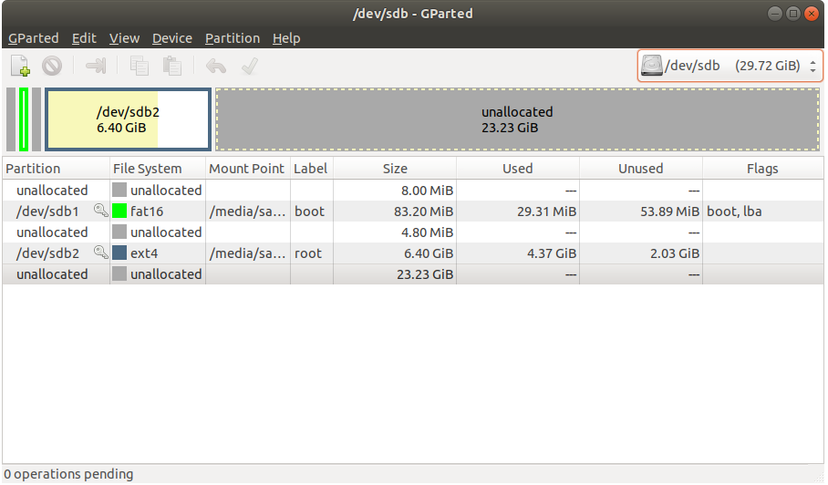
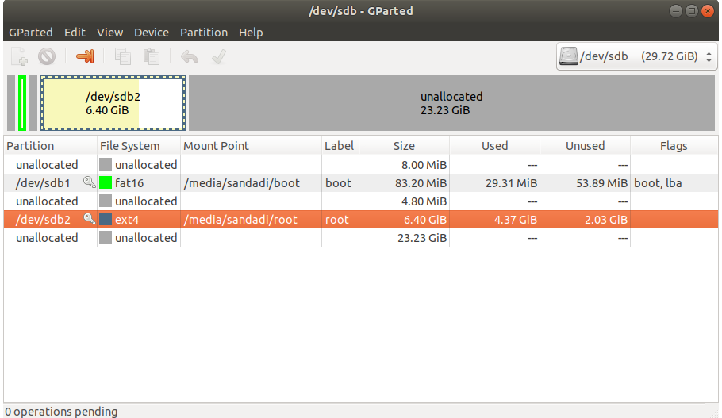
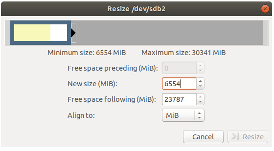
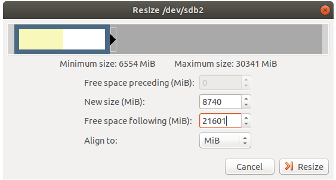
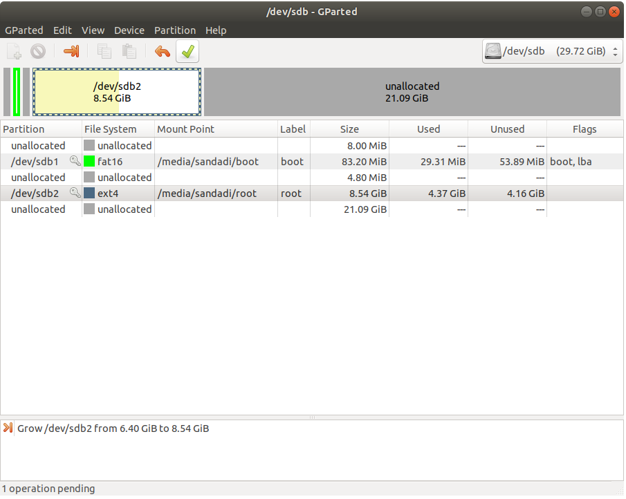
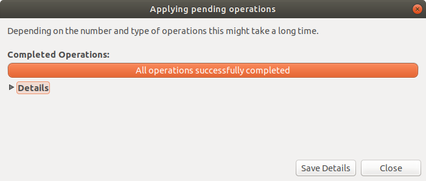
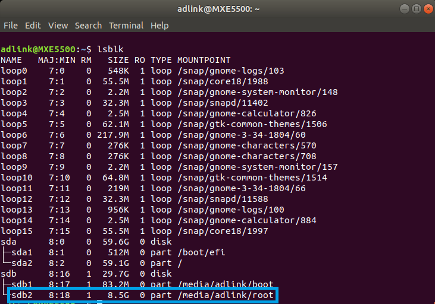

# How to Build Ubuntu

<div class = "bullets">
This procedure describes how to create Ubuntu image with SD Card for I-Pi SMARC IMX8M Plus with 2G/4G Memory. The version of Ubuntu used is 20.04 (Focal Fossa).

## Recommended Hardware

To setup the build environment for Ubuntu image creation, a Linux host with the following configuration is recommended.

- Intel Core-i7 processor (>= 4 cores)

- 8 GB RAM

- 1 TB disk space

- High speed network connectivity

- OS: Ubuntu 18.04 LTS/Ubuntu 16.04 LTS

  <br>

**Update apt repositories list on your host machine and install required packages**

```python
$ sudo apt update
$ sudo apt install build-essential
```

## Getting Started

The following are the steps required to generate Ubuntu image for **I-Pi SMARC IMX8M Plus**.

**Step 1**: Create a Ubuntu 20.04 root file system.
**Step 2:** Downloading Yocto IMX8MP image.
**Step 3:** Replacing IMX8MP yocto image rootfs with Ubuntu 20.04 rootfs.

**Note:** Remember to download yocto image respective to memory. For example, Download 2G image, if you are building Ubuntu image for 2G memory and vice versa.

<br>

### Step 1: Create a Ubuntu root file system

1. Create a new working directory and change directory into it**

```python
$ mkdir $HOME/imx8mp
$ cd HOME/imx8mp
```

2. Create a rootfs directory**

```python
$ mkdir rootfs
```

3. Install deboot strap and its dependencies**

```python
$ sudo apt install debootstrap binfmt-support qemu-user-static
$ sudo debootstrap --arch=arm64 --foreign focal rootfs
```

4. Configure the Rootfs, Add host name to /etc/hostname

Here is an example

```python
$ sudo bash -c"echo'adlink'>rootfs/etc/hostname"
```

5. Add host entry in /etc/hosts

```python
$ sudo bash -c"printf'127.0.0.1\tlocalhost\n127.0.1.1\tadlink\n\n'>rootfs/etc/hosts"
$ sudo bash -c "echo'root::0:0:root:/root:/bin/bash'>rootfs/etc/passwd"
```

6. Prepare QEMU

```python
$ sudo wget https://github.com/multiarch/qemu-user-static/releases/download/v4.2.0-6/qemu-aarch64-static -O rootfs/usr/bin/qemu-aarch64-static
$ sudo chmod +x rootfs/usr/bin/qemu-aarch64-static
```

7. Get your network ready

```python
$ sudo cp /etc/resolv.conf rootfs/etc/
```

8. Mount the proc sys dev file systems

```python
$ for f in proc sys dev dev/pts; do sudo mount --bind /$f rootfs/$f; done
```

9. Change root

```python
$ sudo chroot rootfs /bin/bash
```

10. Add user name

```python
$ /debootstrap/debootstrap --second-stage
$ adduser imx8mp 
#(provide new password and name for the user in the prompt)
$ usermod -a -G sudo imx8mp
```

11. Add required apt repositories to sources.list

```python
$ printf 'deb http://ports.ubuntu.com/ubuntu-ports focal main restricted\n# deb-src http://ports.ubuntu.com/ubuntu-ports focal main restricted\n\ndeb http://ports.ubuntu.com/ubuntu-ports focal-updates main restricted\n# deb-src http://ports.ubuntu.com/ubuntu-ports focal-updates main restricted\n\ndeb http://ports.ubuntu.com/ubuntu-ports focal universe\n# deb-src http://ports.ubuntu.com/ubuntu-ports focal universe\n\ndeb http://ports.ubuntu.com/ubuntu-ports focal-updates universe\n# deb-src http://ports.ubuntu.com/ubuntu-ports focal-updates universe\n\ndeb http://ports.ubuntu.com/ubuntu-ports focal multiverse\n# deb-src http://ports.ubuntu.com/ubuntu-ports focal multiverse\n\ndeb http://ports.ubuntu.com/ubuntu-ports focal-updates multiverse\n# deb-src http://ports.ubuntu.com/ubuntu-ports focal-updates multiverse\n\ndeb http://ports.ubuntu.com/ubuntu-ports focal-backports main restricted universe multiverse \n# deb-src http://ports.ubuntu.com/ubuntu-ports focal-backports main restricted universe multiverse\n\ndeb http://ports.ubuntu.com/ubuntu-ports focal-security main restricted \n# deb-src http://ports.ubuntu.com/ubuntu-ports focal-security main restricted\n\ndeb http://ports.ubuntu.com/ubuntu-ports focal-security universe\n# deb-src http://ports.ubuntu.com/ubuntu-ports focal-security universe\n\ndeb http://ports.ubuntu.com/ubuntu-ports focal-security multiverse\n# deb-src http://ports.ubuntu.com/ubuntu-ports focal-security multiverse' > /etc/apt/sources.list
```

12. Configure locales

You will be prompted through GUI menu to make certain selections such as date/time/region. Please make the appropriate selections and proceed.

```python
$ apt update
$ dpkg-reconfigure locales
```

13. Install ubuntu-desktop and necessary packages

```python
$ apt install ubuntu-desktop
$ apt install vim git sudo net-tools ifupdown kmod iputils-ping man wget bash-completion alsa-utils apt-utils usbutils locales i2c-tools netplan.io tightvncserver lm-sensors usbmount build-essential mesa-utils cmake  can-utils sox v4l-utils glmark2
```

14. Clean up and exit from chroot

```python
$ rm -rf /var/cache/apt/archives/*.deb
$ sync
$ exit
```

15. Unmount the mounted files

```python
$ for f in proc sys dev/pts dev; do sudo umount rootfs/$f; done
```

16. Remove emulator and resolv.conf file

```python
$ sudo rm rootfs/usr/bin/qemu-aarch64-static rootfs/etc/resolv.conf
```

17. Use netplan to enable configurations in networking on the system

 Create a01-network-manager-all.yaml file under /etc/neplan

```python
$ sudo vim $HOME/imx8mp/rootfs/etc/neplan/01-network-manager-all.yaml
```

18. Add the following content, then save it.

 #### Let NetworkManager manage all devices on this system

​                 **network:**

​                             **version: 2**

​                             **renderer: NetworkManager**

19. Make the Root File System

Execute the commands below to make the rootfs.img

Notice that you need change the “count” value according to the size of the “rootfs” folder

Below command will create new rootfs.img file of size 4 GB (3 GB)

```python
$ cd
$ dd if=/dev/zero of=rootfs.img count=4096 status=progress && sync
$ sudo mkfs.ext4 rootfs.img
$ mkdir rootfs
$ sudo mount rootfs.img rootfs/
$ sudo cp -rfp $HOME/imx8mp/rootfs/*  rootfs/
$ sudo umount rootfs/
```

<br>

### Step 2: Downloading Yocto imx8mp image

1. Download the Yocto IMX8MP image

For 2G image [click here](https://hq0epm0west0us0storage.blob.core.windows.net/%24web/public/SMARC/LEC-iMX8MP/Images/Yocto/LEC-IMX8MP-2G-IPi-SMARC-PLUS_Yocto-zeus_1v8_20210908.zip)

For 4G image [click here](https://hq0epm0west0us0storage.blob.core.windows.net/%24web/public/SMARC/LEC-iMX8MP/Images/Yocto/LEC-IMX8MP-4G-IPi-SMARC-PLUS_Yocto-zeus_1v8_20210908.zip)

Unzip the file and flash the Image into SD card

```python
$ sudo bunzip2 -dk -f filename
$ sudo dd if=filename of=/dev/sdX bs=64M status=progress
```

(where X will give mounted device id)

### Step 3: Replacing IMX8MP yocto image rootfs with Ubuntu 20.04 rootfs

1. Unmount the mounted partitions

```python
$ sudo umount /dev/sdc*
```

Note: In our case, /dev/sdb is SD card device name

2. Run GParted in the command line

```python
$ sudo gparted
```

Note: GParted is a free partition editor for graphically managing your disk partitions.

3. Select SD card as highlighted in above corner in below picture

    

4. Select the rootfs partition and select resize option above. Partition 2 (/dev/sdc2) is the rootfs partition in below picture.

  

5. Size of rootfs before resize as shown below



6. Increase the rootfs size i.e /dev/sdb2 here and click on resize button.



7. Save changes and select apply



 

8. Close the GParted and eject SD card. Also connect your SD Card to the development Linux Host PC.



9. Run lsblk command to get the path for mounted rootfs partition.



10.  Remove the existing contents as this filesystem is the default build root file system.

```python
$ sudo rm -rf <mount_path>/*
```

$ sync

11. Create a temporary directory and mount the rootfs.img, which is prepared at Step 1, Preparing Ubuntu Root File System

```python
$ mkdir $HOME/sd_temp
```

```python
$ sudo mountrootfs.img $HOME/sd_temp
```

12. Run the following commands to copy the contents of the ubuntu rootfs.img to the SD card.       

```python
$ sudo cp -rfp$HOME/sd_temp/* <mount_path>/
```

```python
$ sync   
```

```python
$ sudo umount$HOME/sd_temp
```

13. Eject the SD card. 

    You can directly insert SD card into the target board and boot using the SD card.

</div>


