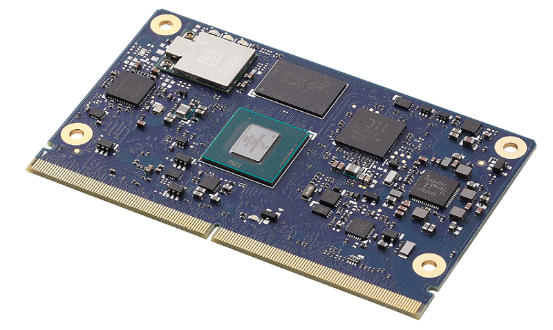

title: Module Introduction 
---
 &nbsp;&nbsp;&nbsp;&nbsp;&nbsp;&nbsp;&nbsp;&nbsp;&nbsp;&nbsp;

 

[Download Datasheet](https://hq0epm0west0us0storage.blob.core.windows.net/$web/public/SMARC/LEC-iMX8MP/documentation/LEC-IMX8MP-datasheet-preliminary-20210128_new.pdf)

 

## The SMARC Formfactor

The SMARC (“Smart Mobility ARChitecture”) is a versatile small form factor computer on Module definition targeting applications that require low power, low costs, and high performance. The Modules will typically use ARM SOCs similar or the same as those used in many familiar devices such as tablet computers and smart phones. Alternative low power SOCs and CPUs, such as tablet oriented X86 devices and other RISC CPUs may be used as well. The Module power envelope is typically under 6W.

Two Module sizes are defined: 82 mm x 50 mm and 82 mm x 80 mm.

The Module PCBs have 314 edge fingers that mate with a low profile 314 pin 0.5 mm pitch right angle connector (the connector is sometimes identified as a 321 pin connector, but 7 pins are lost to the key).

The Modules are used as building blocks for portable and stationary embedded systems. The core CPU and support circuits, including DRAM, boot flash, power sequencing, CPU power supplies, GBE and a single channel LVDS display transmitter are concentrated on the Module. The Modules are used with application specific Carrier Boards that implement other features such as audio CODECs, touch controllers, wireless devices, etc. The modular approach allows scalability, fast time to market and upgradability while still maintaining low costs, low power and small physical size.

SMARC module and carrier specifications are

module and carrier specifications are
available online at : <https://www.sget.org/standards/smarc.html>

## Specifications

### Core System

**SoC**

   NXP i.MX8M Plus with Quad core ARM Cortex-A53
   TrustZone technology supports ARMv8 Cryptography Extensions
   2.3 TOPS Neural Processing Unit (optional)

**Memory**

   2/4/8GB LPDDR4L-4266

**L2 Cache**

   512KB system L2 cache (ECC)

**Security**

   Resource Domain Controller (RDC) supports 4 domains and up to 8 regions of DDR
   Arm® TrustZone® (TZ) architecture: Cortex®-A53 MPCore TrustZone® support
   On-chip RAM (OCRAM) secure region protection using OCRAM controller
   High Assurance Boot (HAB)
   Cryptographic Acceleration and Assurance Module (CAAM)
   Capable to support Widevine and PlayReady content protection
   Public Key Cryptography (PKHA) with RSA and Elliptic Curve (ECC) algorithms
   Real-time integrity checker (RTIC)
   DRM support for RSA, AES, 3DES, DES
   Side channel attack resistance
   True random number generation (RNG)
   Manufacturing protection support / Secure Non-Volatile Storage (SNVS)

**TPM**
​	Optional TPM 2.0 security

**MIPI-DSI**
   1x MIPI-DSI 4 lanes
**Cameras**
MIPI-CSI RX Interface
	 Compatible with the MIPI Alliance Interface specification v1.0 
	 Up to 4 data lanes, 1.0Gbps maximum data rate per lane 
	 Supports MIPI-HS, MIPI-LP mode
1x MIPI-CSI dual lane interface
1x MIPI-CSI quad lane interface

### Video

**GPU Core**
   Vivante GC7000UL 
**GPU Feature Support**
   GC7000UL (2 shaders), OpenGL ES 2.0/3.0/3.1, Vulkan, 
	OpenCL 1.2; GC380 (2D)

**VPU Feature Support**
   1080p60 VP9 Profile 0, 2 (10 bit) decoder (Hantro G2),
   input video stream can be 10-bit, the output decoded
   video is always 8-bit after post-processing in G2 core
   1080p60 HEVC/H.265 decoder (Hantro G2)
   1080p60 AVC/H.264 Baseline, Main, High decoder (Hantro G1)
   1080p60 VP8 decoder (Hantro G1)
   The video encoding features include:
   1080p60 AVC/H.264 Encoder
   1080p60 HEVC/H.265 Encoder

**NPU**

   2.3 TOP/s Neural Network performance

**HDMI**
   HDMI 2.0a 

**MIPI DSI**

   DSI 4 lanes

**LVDS**

   Dual Channel LVDS port 18/24 bit 

**Camera support**

   Compatible with the MIPI Alliance Interface specification v2.1

   Two MIPI-CSI2 camera inputs, one 4-lane and one 2-lane

### Audio
 **Audio Codec**
   I2S audio codec (located on carrier)

### Dual Ethernet
**Primary LAN**

   MAC 10/100/1000 Ethernet Controller on SoC (TSN capable)

**Secondary LAN**

   MAC 10/100/1000 Ethernet Controller on SoC

###  Wireless Communication

**Wi-Fi**
IEEE 802.11 2X2 MIMO ac/a/b/g/n Wireless LAN 

**Bluetooth**
Bluetooth 5.0 complaint with Bluetooth 2.1+Enhanced Data Rate (EDR)

### Extension Busses

**PCIe**

   2x PCIe x1 Gen2.1 *

**USB**

   2x USB 3.0, 3x USB 2.0, 1x USB 2.0 OTG *

**UART**

   Three UART interfaces SER1 and SER 2 (CTS/RTS) / SER0 (TX/RX/CTS/RTS)

**CAN**

   2x CAN2.0B only or mixed CAN2.0B and CAN FD mode, data bit rate up to 8 Mbps

**SPI**

   2x SPI

**I2S**

   2x  I2S interfaces with audio resolution from 16-bits to 32-bits and sample rate up to 192KHz (see Audio Codec support)

**I2C**
   Four I2C interfaces

- Support for 7-bit and 10-bit address mode
- Software programmable clock frequency of 100 kbit/s in Standard-mode, 400 kbit/s in the Fast-mode or 1 Mbit/s in Fast-mode Plus 

**GPIO**

 14x GPIO with interrupt, one GPIO with PWM 

### System Storage

**SDIO**

 1x SDIO (4-bit) compatible with SD/SDIO standard, up to version 3.0

**eMMC**

 16, 32, 64 or 128 GB (build option)
 Compatible with eMMC specifications 4.41, 4.51, 5.0 and 5.1

### SEMA® Board Controller

 Voltage/current monitoring, boot configuration, logistics and forensic 

 information, flat panel control, watchdog timer 

### Debug Header

 30-pin multipurpose flat cable connector for use with optional DB-30 debug module

 Provides JTAG, BMC access; UART, power test points; diagnostic LEDs, Power, Reset, Boot configuration 

### Power

**Input**

5Vdc +/- 5%

### Mechanical and Environmental

**Form Factor**

SGET SMARC Specifications 2.1

**Dimensions**

SMARC short size module, 82mm x 50mm

**Operating Temperature**

Standard: 0°C to +60°C

Rugged: -20°C to +85°C (optional)

**Humidity**

5-90% RH operating, non-condensing

5-95% RH storage (and operating with conformal coating)

**Shock and Vibration**

IEC 60068-2-64 and IEC-60068-2-27, MIL-STD-202 F, 

Method 213B, Table 213-I, Condition A and Method 214A,

Table 214-I, Condition D

**HALT**

Thermal Stress, Vibration Stress, Thermal Shock and Combined Test

### Operating Systems 

**Standard Support**

Yocto Linux BSP, Android

 **Extended Support (BSP)**
 VxWorks

