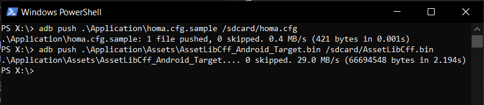
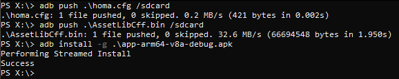
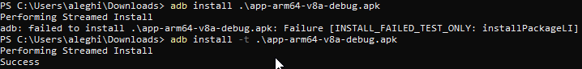

# Candera CGI Studio demo on I-Pi SMARC IMX8M Plus devkit

This procedure describes a quick guide for deploying HOMA Demo for Android on I-Pi SMARC IMX8M Plus
For requirements and how to set up your environment and appropriate utilities, refer to following document:

Android Support documentation for I-Pi SMARC IMX8M Plus [click here](AndroidImages.html).

## Prerequisites

### **Hardware Requirement:**

1. I-Pi SMARC IMX8M Plus Development Kit
2. Monitor, Keyboard and Mouse
3. HDMI Display

### **Software Requirement**

Android as desired OS [click here](https://www.ipi.wiki/pages/downloads-imx8mplus).

Refer this link for flashing Image into micro SD card.

[How to Flash Yocto or Android into the SD Card](HowToFlashImageSD.html#Flash-Yocto-or-Android-Image)

**Note**: You can also download the Image along with Android and CGI Demo [click here](https://hq0epm0west0us0storage.blob.core.windows.net/$web/public/SMARC/LEC-iMX8MP/Images/SoftwarePartner/LEC-IMX8MP_2G_IPi_SMARC_Plus_Android_CGI_demo.zip).

#### Step 1: I-Pi SMARC IMX8M Plus Connections

Refer this link for I-Pi Connections.
<https://www.youtube.com/watch?v=Axp5oOVpnDE>

#### **Step 2**: Deploying

- Deploying on an Android device simply happens by clicking on APP icon on the home screen.

- You need to connect I-Pi SMARC IMX8M Plus  with android image by MICRO USB OTG cable to your host computer.

- To get the application working, two files must be deployed on the target device locally which means, the files must be placed in rootfs of the device.

  - [x] Application/**homa.cfg.sample**à /sdcard/**homa.cfg**

  - [x] Application/Assets/**AssetLibCff_Android_Target.bin** à /sdcard/**AssetLibCff.bin**

This can be done by drag and drop utilizing Explorer or by the **adb** command line tool on power shell.

Refer the below image.

#### Installing App from Zip package

If you just got a ZIP package containing the APK (android application), asset file and config file, you don’t need any of the steps described before. You only need to install following files:

- homa-arm64-v8a-debug.apk

- homa.cfg
- AssetLibCff.bin

 You can do this by utilizing explorer by drag and drop, or much more convenient and faster by utilizing adb command on powershell.

**Note:** If you experience an error like shown in following trial, try the **-t** switch. 

**Explanation:**

**-g**  : Grant all permissions during install (not important, just for convenience). If you omit this switch, android will ask you to grant permissions.

**-t**   : Set test Only flag to false. Only necessary if you face the mentioned error.

