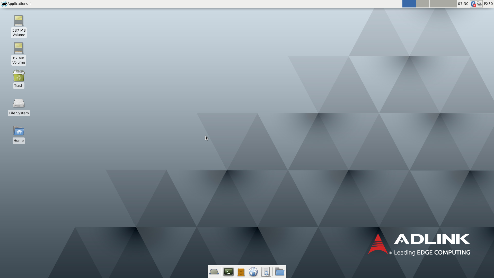
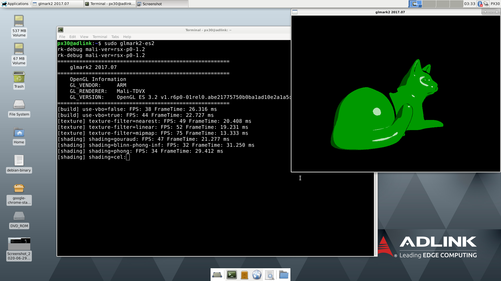

title: Debian Image
---

## Debian 10 Buster with Xfce Desktop Environment

Boot the system with the SD card placed in the slot located on the carrier, once booted you will see the login screen.

​       **Note:** The kernel used is not Debian native. Debian rootfs image which is bootstrapped by the PX30 u-boot & Kernel.

 

### Binary Image download Link

* Debian 10 Buster with XFCE desktop + MRAA/UPM (size of compressed file: 1.57 GB): [click here](https://hq0epm0west0us0storage.blob.core.windows.net/$web/public/SMARC/LEC-PX30/Images/Debian/LEC-PX30-IPi-SMARC-Debian10-xfce-2v7-20210219.zip)

* All versions: <a data-toggle="collapse" data-target="#demo" href="#">click here</a>

    
<iframe class="download-area" src="https://hq0epm0west0us0storage.z22.web.core.windows.net/?prefix=public/SMARC/LEC-PX30/Images/Debian/&amp;pageLevel=0" scrolling="no">
      	</iframe>

    

   **Note**: 

1. Auto-login is enabled and no need to enter password   
2. Please refer to [here](HowToFlashImage.html#Flash-a-Ubuntu-Debian-Image) to guide you how to flash image to SD card
3. Boot selector in I-Pi board won't work due to the design of [PX30 booting procedure](PX30BootFlow.html)

 

### Usernames and passwords

   * Two users are defined for use on the system: **px30** and **root**.
   * Passwords is **adlink123** for two users.

 

### Supported features & interfaces 

* Linux Kernel version: **4.4.167**
* [40 Pin expansion Header](UserInterfaces.html) with [Eclipse Mraa library](https://github.com/eclipse/mraa) and [Eclipse UPM library](https://github.com/eclipse/upm) which supports C/C++, Python, JAVA and JavaScript 
* [SEMA 4.0](https://adlink-epm.github.io/sema-doc/#/) (Smart Embedded Management Agent) support the functions such as CPU temperature, voltage monitoring  total up time, ... etc.
* 2D / 3D Graphics Acceleration [with Arm Mali-G31 GPU](https://developer.arm.com/ip-products/graphics-and-multimedia/mali-gpus/mali-g31-gpu) which supports x11 display server
* Support H.265, H.264, VP8, MPEG4 and MPEG2 video codec with up to 1080p60fps
* HDMI output with the resolution up to 1920x1080@60Hz
* 4x USB 2.0  ports
* 2x  10/100 Mb LAN ports 
* USB OTG Serial Gadget supported (baud rate: 115200)
* CAN FD Bus interface
* Analog to Digital input interface
* Audio & speaker
* Raspberry Pi Camera V2.1 (2 Lanes) - SONY iMX219 sensor ([Datasheet](https://www.raspberrypi.org/documentation/hardware/camera/))  
* WIFI/BT USB Dongle ([EW-7611ULB datasheet](https://www.edimax.com/edimax/mw/cufiles/files/download/datasheet/EW-7611ULB_datasheet_English.pdf))

  

**Running glmark2-es2 program to benchmark for Mali-G31 with x11**

