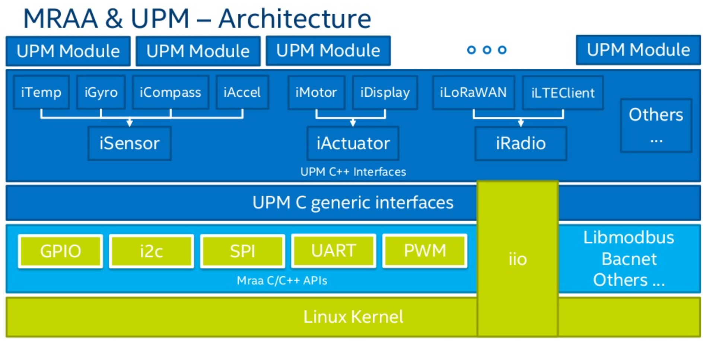

<div class = "bullets">

## What is MRAA/UPM 


Eclipse MRAA/UPM is a C/C++ library with bindings to Java, Python and JavaScript to interface with the IO, with a structured and sensors API where port names/numbering matches the board that you are on. Use of libmraa does not tie you to specific hardware with board detection done at runtime you can create portable code that will work across the supported platforms.

The intent is to make it easier for developers and sensor manufacturers to map their sensors & actuators on top of supported hardware and to allow control of low level communication protocol by high level languages & constructs. Also. please refer to [Introduction to MRAA](https://projects.eclipse.org/proposals/eclipse-mraa) & [Introduction to UPM](https://upm.mraa.io/) for more details.



**Note:** 

1. By default, MRAA/UPM library is already on PX30 Yocto/Ubuntu/Debian images. 

3. ADLINK MRAA libraries has been contributed to [**Eclipse MRAA GitHub**]( https://github.com/eclipse/mraa) which is supported on **LEC-PX30 & LEC-AL-AI with industrial I-Pi SMARC** 


<br>


##  how to build & install MRAA/UPM on Yocto/Ubutnu/Debian:

* [Guideline to Debian](HowToInstallMRAAUPM.html#Debian)
* [Guideline to Ubuntu](HowToInstallMRAAUPM.html#Ubuntu)
* [Guideline to Yocto](HowToInstallMRAAUPM.html#Yocto)

<br>

### Debian

#### Building & Installing MRAA

1. Install required dependencies.

```shell
sudo apt install git build-essential swig3.0 python-dev libnode-dev cmake libjson-c-dev
```

2. Before compiling MRAA/UPM source, need to downgrade the already installed cmake utility. Please download cmake.zip form [here](https://hq0epm0west0us0storage.blob.core.windows.net/development/LEC-PX30/Images/Ubuntu/UbuntuNecessaryFiles/cmake.zip).

```shell
$ sudo apt purge --autoremove cmake
$ unzip cmake.zip
$ cd cmake
$ sudo dpkg -i *.deb
$ cd ..
```

3. Download MRAA source from github and compile.

```shell
$ git clone https://github.com/eclipse/mraa.git
$ cd mraa
$ cmake /home/adlink/mraa
$ make -j4
$ sudo make install
$ cd ..
```

**Note**: If user requires adlink test applications apply patch and build. please download git patch from [here](https://hq0epm0west0us0storage.blob.core.windows.net/development/LEC-PX30/Images/Ubuntu/UbuntuNecessaryFiles/mraa.patch).

```shell
$ git clone https://github.com/eclipse/mraa.git
$ cd mraa
$ git apply mraa.patch
$ cmake /home/adlink/mraa
$ make -j4
$ sudo make install
$ cd ..
```

5. After install user can remove mraa source.

```shell
rm -rf mraa
```

**Note** Example applications get installed into **/usr/local/share/mraa/examples/c**


#### Building & Installing UPM
1. Install required dependencies

```shell
$ sudo apt install automake libpcre3-dev bison pkg-config libnode-dev  python3-distutils python3-dev libjpeg-dev
```

2. Download SWIG source and compile.

```shell
$ git clone https://github.com/swig/swig.git
$ cd swig
$ ./autogen.sh
$ ./configure
$ make -j4
$ sudo make install
$ cd ..
```

3. Download UPM source and compile.

```shell
$ git clone https://github.com/eclipse/upm.git
$ cd upm
$ mkdir build
$ cd build
$ cmake .. "-DBUILDEXAMPLES=on"
$ make -j4
$ sudo make install
$ cd ..
```

4. After installing, user can remove swig and upm sources.

```shell
$ rm -rf swig 
$ rm -rf upm
```

5. Update LD_LIBRARY_PATH.

```shell
$ sudo ldconfig
```

<br>

### Ubuntu

#### Building & Installing MRAA 

1. Install required dependencies.

```shell
sudo apt install git build-essential swig3.0 python-dev nodejs-dev cmake libjson-c-dev
```

2. Download MRAA source from github and compile.

```shell
$ git clone https://github.com/eclipse/mraa.git
$ cd mraa
$ cmake /home/adlink/mraa
$ make -j4
$ sudo make install
$ cd ..
```

**Note:** If user requires adlink test applications apply patch and build. Please download git patch from [here](https://hq0epm0west0us0storage.blob.core.windows.net/development/LEC-PX30/Images/Ubuntu/UbuntuNecessaryFiles/mraa.patch).

```shell
$ git clone https://github.com/eclipse/mraa.git
$ cd mraa
$ git apply mraa.patch
$ cmake /home/adlink/mraa
$ make -j4
$ sudo make install
$ cd ..
```

After install user can remove mraa source.

```shell
rm -rf mraa
```

**Note:** Example applications get installed into **/usr/local/share/mraa/examples/c**


#### Building & Installing UPM   

Install required dependencies on ubuntu.

```shell
$ sudo apt install automake libpcre3-dev bison pkg-config nodejs-dev python3-distutils python3-dev libjpeg-dev
```

Download SWIG source and compile.

```shell
$ git clone https://github.com/swig/swig.git
$ cd swig
$ ./autogen.sh
$ ./configure
$ make -j4
$ sudo make install
$ cd ..
```

Download UPM source and compile.

```shell
$ git clone https://github.com/eclipse/upm.git
$ cd upm
$ mkdir build
$ cd build
$ cmake .. "-DBUILDEXAMPLES=on"
$ make -j4
$ sudo make install
$ cd ..
```

After installing, user can remove swig and upm sources.

```shell
$ rm -rf swig 
$ rm -rf upm
```

Update LD_LIBRARY_PATH.

```shell
$ sudo ldconfig
```

### Yocto

Intel mraa recipe is [here](http://git.yoctoproject.org/cgit/cgit.cgi/meta-intel-iot-middleware/tree/recipes-devtools?h=daisy) and please add it to your building Yocto.


</div>

<style>
.bullets ul li {
    list-style-type: disc;
 }
 .bullets ol li {
    list-style-type: decimal;
 }
</style>

