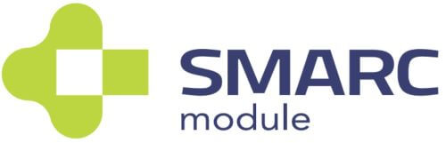

title: Module Introduction 
---

# LEC-PX30

## The SMARC Formfactor

The SMARC (“Smart Mobility ARChitecture”) is a versatile small form factor computer on Module definition targeting applications that require low power, low costs, and high performance. The Modules will typically use ARM SOCs similar or the same as those used in many familiar devices such as tablet computers and smart phones. Alternative low power SOCs and CPUs, such as tablet oriented X86 devices and other RISC CPUs may be used as well. The Module power envelope is typically under 6W.

Two Module sizes are defined: 82 mm x 50 mm and 82 mm x 80 mm. 

The Module PCBs have 314 edge fingers that mate with a low profile 314 pin 0.5 mm pitch right angle connector (the connector is sometimes identified as a 321 pin connector, but 7 pins are lost to the key).

The Modules are used as building blocks for portable and stationary embedded systems. The core CPU and support circuits, including DRAM, boot flash, power sequencing, CPU power supplies, GBE and a single channel LVDS display transmitter are concentrated on the Module. The Modules are used with application specific Carrier Boards that implement other features such as audio CODECs, touch controllers, wireless devices, etc. The modular approach allows scalability, fast time to market and upgradability while still maintaining low costs, low power and small physical size.

SMARC module and carrier specifications are
available online at :    https://www.sget.org/standards/smarc.html

## Specifications

### Core System

**SoC**

Rockchip PX30 with Quad-core ARM Cortex-A35 CPU TrustZone technology support ARMv8 Cryptography Extensions”

**Memory**

1GB or 2GB DDR3L at 1066/1333 MHz, memory down (non ECC)

**L2 Cache**

256KB unified system L2 cache

 

**IoT security**

CryptoAuthentication™ Device, Microchip ATECC608A

Cryptographic co-processor with secure hardware-based key storage for sign-verify authentication provides Internet of Things (IoT) Protected 
Storage for up to 16 keys, certificates or data ECDH: FIPS SP800-56A Elliptic Curve Diffie-Hellman NIST standard P256, elliptic curve support SHA-256 & HMAC hash including off-chip context save/restore AES-128: encrypt/decrypt, galois field multiply for GCM”

 

### Video

LEC-PX30 standard display support is limited to either 4-lane MIPI DSI or single channel 24-bit LVDS. DSI and LVDS are multiplexed and either of them can simply be enabled at boot time.  HDMI panel support up to 1920x1080 resolution can be achieved by using a simple bridge on the carrier. A reference design based on ADV7335 “MIPI/DSI Receiver with HDMI Transmitter” is available

 

**GPU Core:** 

Mali-G31

**GPU Feature Support**

Supports DirectX 11 FL9_3, OpenGLES 1.1/ 2.0 / 3.2, Vulkan 1.0, OpenCL 2.0

Full Profile Video decoding: H.264 up to 1080p@60fps, H.265/HEVC up to 1080p@60fps

MPEG-4, ISO/IEC 14496-2, SP@L0-3, ASP@L0-5, up to 1080p@60fps VP8, up to 1080p@60fps

Video Encoding: H.264 video encoder at BP/MP/HP@level 4.2 1920x1080@30fps, 1x 1080p@30fps or 2x 720p@30fps encoding

 

**MIPI DSI**

MIPI DSI 4 lanes at max. 1080p@60fps display output (default, multiplexed with LVDS signal) 

 

**LVDS**

LVDS single channel 24-bit at max. 1280x800@60fps (multiplexed with MIPI DSI signal)

 

**Camera**

MIPI CSI RX Interface

\- Compatible with the MIPI Alliance Interface specification v1.0

\- Up to 4 data lanes, 1.0Gbps maximum data rate per lane, supporting MIPI-HS, MIPI-LP mode

### Audio

Supports ES8316 codec for high performance and low power multi-bit deltasigma

audio ADC and DAC (located on carrier)

### Dual Ethernet

**Primary LAN**

MAC 10/100 Ethernet Controller on SoC
Supports 10/100-Mbps data transfer rates, both full-duplex and half-duplex

 

**Secondary LAN**

MAC/PHY 10/100 Ethernet Controller on LAN9514 via USB 2.0
Supports 10/100-Mbps data transfer rates, both full-duplex and half-duplex

### Extension busses

**USB**

4x USB 2.0, 1x USB OTG

 

**UART**

Two UART interfaces SER0 and SER2 (TX/X/CTS/RTS), 64-byte FIFO and support for 5-bit, 6-bit, 7-bit, 8-bit data transmit or receive

**CAN bus**

Supports CAN2.0B only or mixed CAN2.0B and CAN FD mode, data bit rate up to 8 Mbps

 

**SPI**

2x SPI (one occupied by SPI-to-CAN controller)

 

**I2S**

2x I2S interfaces with audio resolution from 16-bits to 32-bits and sample rate up to 192KHz (see Audio Codec support)

 

**I2C**

Four I2C interfaces

\- Support for 7-bit and 10-bit address mode

\- Software programmable clock frequency of 100 kbit/s in Standard-mode,

400 kbit/s in the Fast-mode or 1 Mbit/s in Fast-mode Plus

 

**GPIO**

12x GPIO with interrupt, one GPIO with PWM

### System Storage

**SDIO**

1x SDIO (4-bit) compatible with SD3.0, MMC ver. 4.51

 

**eMMC**

8, 16, 32 or 64 GB (build option)
Compatible with eMMC specification 4.41, 4.51, 5.0 and 5.1

### SEMA® Board Management Controller

Voltage/current monitoring, boot configuration, logistics and forensic

information, flat panel control, watchdog timer

### Debug Header

30-pin multipurpose flat cable connector for use with optional DB-30 debug module Provides JTAG, BMC access; UART, power test points; diagnostic LEDs, Power, Reset, Boot configuration

 

### Power

**Supply Voltage** 

4.75 V – 5.25 V 

 

### Mechanical and Environmental

**Form Factor**

SGET SMARC Specifications v2.1

**Dimension**

SMARC short size module, 82mm x 50mm

**Operating Temperature**

Standard: 0°C to +60°C

Rugged: -20°C to +85°C (optional)

**Humidity**

5-90% RH operating, non-condensing

5-95% RH storage (and operating with conformal coating)

**Shock and Vibration**

IEC 60068-2-64 and IEC-60068-2-27, MIL-STD-202 F, Method 213B, Table 213-I,

Condition A and Method 214A, Table 214-I, Condition D