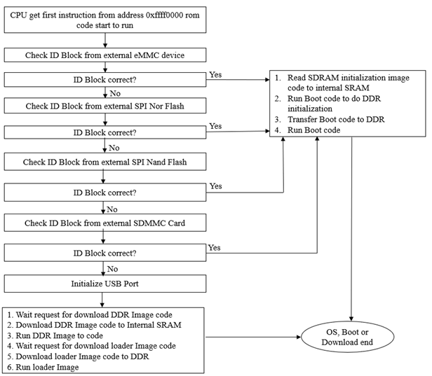

title: Boot Order on LEC-PX30
---

The following figure explains the Boot procedure of LEC-PX30 in I-Pi board. 

Boot  order DIP switch specified in the SMARC specification is ignored by the PX30 SOC
PX30 SOC has a fixed scan order where the first bootable device is used as boot device. 

On the LEC-PX30 only eMMC and SDMMC are implemented as boot device. 

If both eMMC and SDMMC (SD Card) are accessible, and both have a bootable image, than the eMMC will be used as boot device. 
In a case like this the only way to boot from the SD Card is to invalidate (overwrite) the bootable image in the eMMC.     

