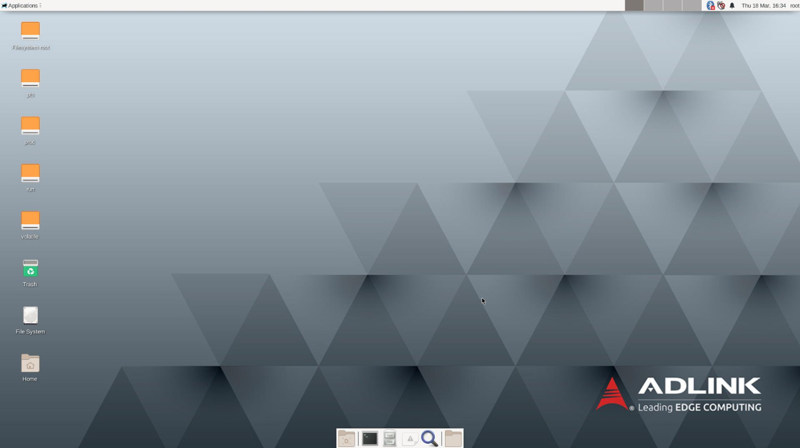

title: Yocto Linux Images
---

 

## Yocto Dunfell with XFCE Desktop Environment

Boot the system with the SD card placed in the slot located on the carrier, once booted you will see the login screen:

 

### Binary Image Download Link
* Yocto Dunfell with XFCE Desktop + MRAA/UPM (size of compressed file: 298 MB): [click here](https://hq0epm0west0us0storage.blob.core.windows.net/public/SMARC/LEC-PX30/Images/Yocto/LEC-PX30-IPi-SMARC_Yocto-Zeus-v2.4_SD_20200909.zip)

* All versions: <a data-toggle="collapse" data-target="#demo" href="#">click here</a>
  
    
<iframe class="download-area" src="https://hq0epm0west0us0storage.z22.web.core.windows.net/?prefix=public/SMARC/LEC-PX30/Images/Yocto/&amp;pageLevel=0" scrolling="no">
      	</iframe>

    

**Note:**

  1 .  Auto-login is enabled and no need to enter password.     
  2. Please refer to [here](HowToFlashImage.html#Flash-a-Yocto-or-Android-Image) to guide you how to flash image to SD card.
  3. Boot selector in I-Pi board won't work due to the design of [PX30 booting procedure](PX30BootFlow.html).

 

### Usernames and passwords

* One user is defined on the system: **root**
* password is **adlink123**

 

### Supported features & interfaces 

* Linux Kernel version: **4.4.185**
* [40 Pin expansion Header](UserInterfaces.html) with [Eclipse Mraa library](https://github.com/eclipse/mraa) and [Eclipse UPM library](https://github.com/eclipse/upm) which supports C/C++, Python, JAVA and JavaScript 
* [SEMA 4.0](https://adlink-epm.github.io/sema-doc/#/) (Smart Embedded Management Agent) support the functions such as CPU temperature, voltage monitoring  total up time, ... etc.
* Support H.265, H.264, VP8, MPEG4 and MPEG2 video codec with up to 1080p60fps
* HDMI output with resolution 1920x1080@60Hz
* 4x USB 2.0 ports
* 2x 10/100 Mb LAN ports
* USB OTG Serial Gadget supported (baud rate: 115200)
* CAN FD Bus interface
* Analog to Digital input interface
* Audio & speaker
* Raspberry Pi Camera V2.1 (2 Lanes) - SONY iMX219 sensor ([Datasheet](https://www.raspberrypi.org/documentation/hardware/camera/))
* WIFI/BT USB Dongle ([EW-7611ULB datasheet](https://www.edimax.com/edimax/mw/cufiles/files/download/datasheet/EW-7611ULB_datasheet_English.pdf))

 

