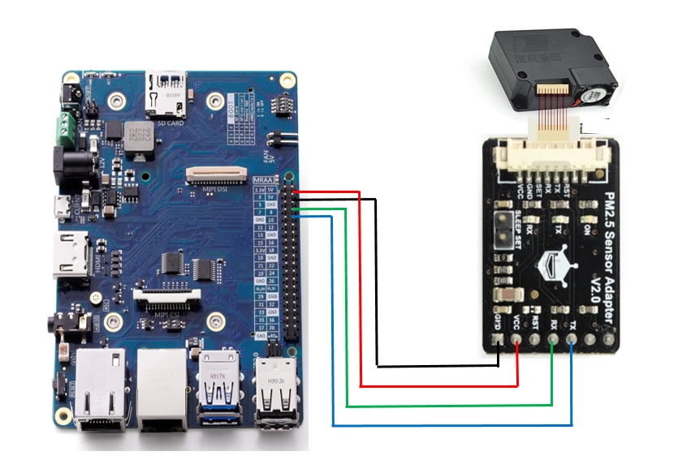
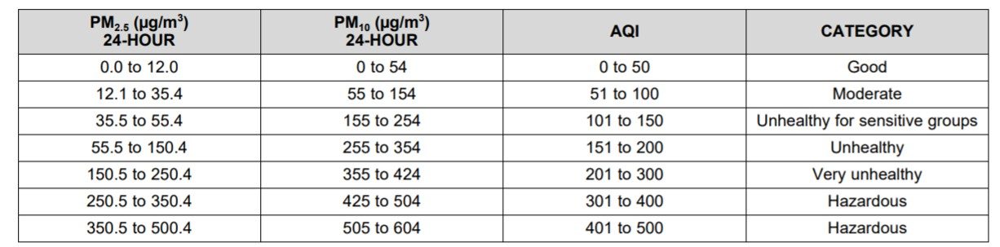

title: Tutorial 10 - How to enable the air quality monitoring with PM2.5 sensor
---

<div class="bullets">
<div class="contentiframe">

<iframe  class="responsive-iframe"  width="640" height="480" src="https://www.youtube.com/embed/AP7uCtMXtlY" frameborder="0" allow="autoplay; encrypted-media" allowfullscreen></iframe>

</div>

It describes about how to use PM2.5 sensor for monitoring air quality on I-Pi




## **Hardware Requirement:**

1. I-Pi SMARC PX30 Development Kit
2. Monitor, Keyboard and Mouse
3. HDMI Display

Refer this link for I-Pi Connections
https://www.youtube.com/watch?v=luzU_IYuRQI

## **Software Requirement**

1. Debian/Ubuntu/Yocto as desired OS. Here is the images for you: 
   1. [The download link](../DebianImages.html#Binary-Image-download-Link) for **the latest Debian binary images** which built by ADLINK if you need.
   2. [The download link](../UbuntuImages.html#Binary-Image-download-Link) for **the latest Ubuntu binary images** which built by ADLINK if you need.
   3. [The download link](../YoctoImages.html#Binary-Image-download-Link) for **the latest Yocto binary images** which built by ADLINK if you need.

Refer this links flashing the Image in to micro SD card

1. https://www.youtube.com/watch?v=-Vq7yLV5thQ&t=11s ( Guide to How to Flash Yocto SD Card image)
2. https://www.youtube.com/watch?v=qunkNOpYzGQ&t=72s ( Guide to how to Flash Debian/Ubuntu SD Card image)

### **PM2.5 sensor description**

PM2.5 laser dust sensor is a digital universal particle concentration sensor, it can be used to obtain the number of suspended particulate matter in a unit volume of air within 0.3 to 10 microns. The Air Quality sensors can be embedded in a variety of concentrations of environment-related instruments suspended particulate matter in the air, to provide timely and accurate concentration data. 


#### **How it works**

This PM2.5 sensor uses a laser scattering theory. And the scattering of laser irradiation in the air suspended particles, while collecting the scattered light at a specific angle, to obtain the scattering intensity versus with time curve. After the microprocessor data collection, it gets the relationship between the time domain and frequency domain by Fourier transform, and then through a series of complex algorithms to obtain the number of particles in the equivalent particle size and volume units of different size.


#### **Specifications**

* Operating voltage: 4.95 ~ 5.05V
* Maximum electric current: 120mA
* Measuring pm diameter: 0.3-1.0, 1.0-2.5, 2.5-10(um)
* Measuring pm range: 0~500 ug/m3
* Standby current: ≤200 uA
* Response time: ≤10 s
* Operating temperature range: -20 ~ 50C
* Operating humidity range: 0 ~ 99% RH
* Maximum size: 65 × 42 × 23 (mm)
* MTBF: >= 5 years
* Quick response
* Standard serial input word output
* Second-order multi-point calibration curve
* The minimum size of 0.3 micron resolution


## **Step 1:** Updating Repositories

Insert the SD card and start the development host. Its always better to update your apt repositories in your host machine

```python
$ sudo apt update
```

## **Step 2:** Location of directory

if you boot your I-Pi with Yocto, go to the following directory

```python
$ cd /usr/share/upm/examples/python/
```

If you boot your I-Pi with Debian/Ubuntu, go to the following directory

```python
$ cd /usr/local/share/upm/examples/python/
```

## **Step 3:** Sensor code

Then you can find the souce code in this directory named as hka5.py
To view the code, type

```python
 $ sudo vi hka5.py
```
You can also change the time in loop as per your requirement

```python
from __future__ import print_function
import time, sys, signal, atexit
from upm import pyupm_hka5 as sensorObj

def main():
# Instantiate a HKA5 sensor on uart 0.  We don't use the set or
# reset pins, so we pass -1 for them.
sensor = sensorObj.HKA5(0, -1, -1)

## Exit handlers ##
# This function stops python from printing a stacktrace when you hit control-C
def SIGINTHandler(signum, frame):
    raise SystemExit

# This function lets you run code on exit
def exitHandler():
    print("Exiting")
    sys.exit(0)

# Register exit handlers
atexit.register(exitHandler)
signal.signal(signal.SIGINT, SIGINTHandler)

# update once every 2 seconds and output data
while (True):
    sensor.update()

    print("PM 1  :", end=' ')
    print(sensor.getPM1(), end=' ')
    print(" ug/m3")

    print("PM 2.5:", end=' ')
    print(sensor.getPM2_5(), end=' ')
    print(" ug/m3")

    print("PM 10 :", end=' ')
    print(sensor.getPM10(), end=' ')
    print(" ug/m3")

    print()
    time.sleep(2)

if __name__ == '__main__':
main()
```
## **Step 4:** Execution

execution the code

```python
$ sudo python3 hka5.py
```

If you are not the root user, add sudo before the executing commands. The output of PM2.5 sensor changes according to changes in the atmospheric air to indicate the PM levels. The below table shows the index values and their categories




</div>
