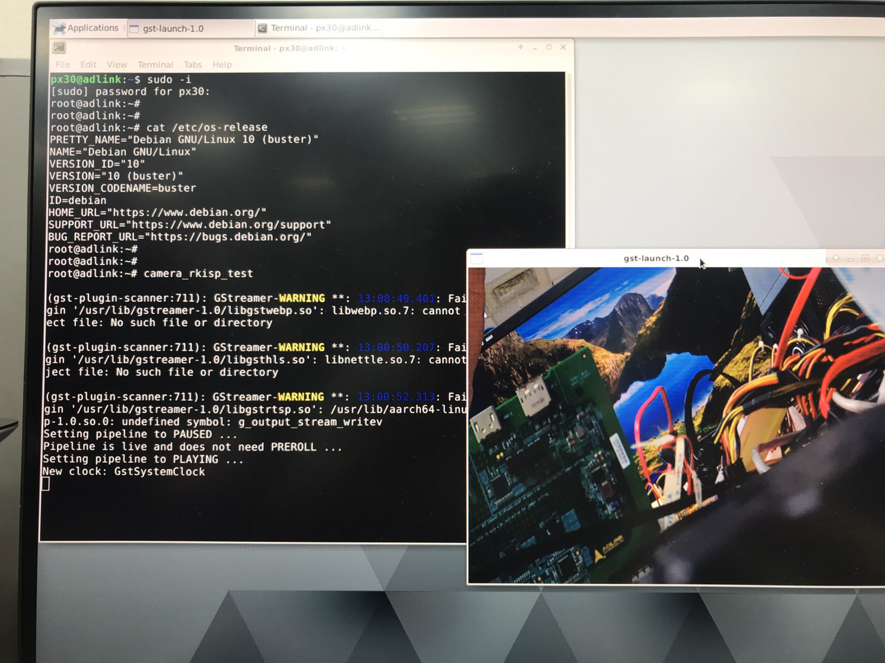

title: Tutorial 6 - How to enable Raspberry Pi Camera Module
---

<div class="contentiframe">

<iframe  class="responsive-iframe" width="640" height="480" src="https://www.youtube.com/embed/UduSlKTSDMs"  frameborder="0" allow="autoplay; encrypted-media" allowfullscreen></iframe>

</div>

It describes how to connect the Raspberry Pi Camera Module V2.1 to I-Pi SMARC PX30 development kit and also teaches how to take pictures, record video, and apply image effects

##  Step 1: I-Pi connections

We need other connections on I-Pi to view the display captured from Camera, so refer [this link](https://www.youtube.com/watch?v=luzU_IYuRQI) for connections on I-Pi 

## Step 2: Interfacing camera module with I-Pi SMARC

**Notes:** The pins of CSI connector are very delicate, so connect it carefully.

Install few other dependencies for our applications under Ubutnu/Debian images. 

```
$ sudo apt-get install libqt5gui5 libqt5qml5 libqt5quick5 libqt5webkit5 libqt5qml5 libqt5core5a qml-module-qtquick-controls qml-module-qtquick2 libqt5widgets5 libqt5x11extras5 qml-module-qtquick-dialogs
```

Note: Here is the Debian/Ubuntu images:

1. [The download link](../DebianImages.html#Binary-Image-download-Link) for **the latest Debian binary images** which built by ADLINK if you need.
2. [The download link](../UbuntuImages.html#Binary-Image-download-Link) for **the latest Ubuntu binary images** which built by ADLINK if you need.


## Step 3: Testing the Camera

```python
$ Camera_rkisp_test
```

Note: if you do not have root privileges, use sudo before executing the commands



To display the video portion of an MPEG-1 video file alone and outputting to an X display window, use the below command:

```python
$ gst-launch-1.0 filesrc location=videofile.mpg ! dvddemux ! mpeg2dec ! xvimagesink
```

To display the video portion of a .vob file (used on DVDs) and outputting to an SDL window, use the below command:

```python
$ gst-launch-1.0 filesrc location=flflfj.vob ! dvddemux ! mpeg2dec ! sdlvideosink
```

To play both video and audio portions of an MPEG movie, use the below command:

```python
$ gst-launch-1.0 filesrc location=movie.mpg ! dvddemux name=demuxer demuxer. ! queue ! mpeg2dec ! sdlvideosink demuxer. ! queue ! mad !  audioconvert ! audioresample ! osssink
```

To play an AVI movie with an external text subtitle stream, use the below command:

```python
$ gst-launch-1.0 filesrc location=movie.mpg ! mpegdemux name=demuxer demuxer. ! queue ! mpeg2dec ! videoconvert ! sdlvideosink demuxer. ! queue ! mad ! audioconvert ! audioresample ! osssink
```

This command shows how to refer to specific pads by name if an element has multiple sink or source pads:

```python
$ gst-launch-1.0 textoverlay name=overlay ! videoconvert ! videoscale ! autovideosink filesrc location=movie.avi ! decodebin2 !  videoconvert ! overlay.video_sink filesrc location=movie.srt ! subparse ! overlay.text_sink
```

To play an AVI movie with an external text subtitle stream using playbin, use the the below command:

```python
$ gst-launch-1.0 playbin uri=<file:///path/to/movie.avi>
suburi=<file:///path/to/movie.srt>
```

## Step 4: Network streaming

To stream video using RTP and network elements, use the following commands

Use this command to run on the transmitter:

```python
$ gst-launch-1.0 v4l2src ! video/x-raw-yuv,width=128,height=96,format='(fourcc)'UYVY ! videoconvert ! ffenc_h263 ! video/x-h263 ! rtph263ppay pt=96 ! udpsink host=192.168.1.1 port=5000 sync=false
```

Use this command to run on the receiver:

```python
$ gst-launch-1.0 udpsrc port=5000 ! application/x-rtp, clock-rate=90000,payload=96 ! rtph263pdepay queue-delay=0 ! ffdec_h263 ! xvimagesink
```

<br>

## **Raspberry Pi camera V2.1 Description** 


The Raspberry Pi Camera Modules are official products from the Raspberry Pi Foundation. The original 5-megapixel model was [released](https://www.raspberrypi.org/blog/camera-board-available-for-sale/) in 2013, and an 8-megapixel [Camera Module v2](https://www.raspberrypi.org/products/camera-module-v2/) was [released](https://www.raspberrypi.org/blog/new-8-megapixel-camera-board-sale-25/) in 2016. For both iterations, there are visible light and infrared versions.

### Hardware specification

|                                |          Camera Module v2           |
| :----------------------------- | :---------------------------------: |
| Net price                      |                 $25                 |
| Size                           |        Around 25 × 24 × 9 mm        |
| Weight                         |                 3g                  |
| Resolution                     |            8 Megapixels             |
| Video modes                    | 1080p30, 720p60 and 640 × 480p60/90 |
| Linux integration              |        V4L2 driver available        |
| C programming API              |   OpenMAX IL and others available   |
| Sensor                         |             Sony IMX219             |
| Sensor resolution              |         3280 × 2464 pixels          |
| Sensor image area              |  3.68 x 2.76 mm (4.6 mm diagonal)   |
| Pixel size                     |          1.12 µm x 1.12 µm          |
| Optical size                   |                1/4"                 |
| Full-frame SLR lens equivalent |                 NA                  |
| S/N ratio                      |                 NA                  |
| Dynamic range                  |                 NA                  |
| Sensitivity                    |                 NA                  |
| Dark current                   |                 NA                  |
| Well capacity                  |                 NA                  |
| Fixed focus                    |                 NA                  |
| Focal length                   |               3.04 mm               |
| Horizontal field of view       |            62.2 degrees             |
| Vertical field of view         |            48.8 degrees             |
| Focal ratio (F-Stop)           |                 2.0                 |

### Hardware features

| Available                                                    | Implemented                                                  |
| :----------------------------------------------------------- | :----------------------------------------------------------- |
| Chief ray angle correction                                   | Yes                                                          |
| Global and rolling shutter                                   | Rolling shutter                                              |
| Automatic exposure control (AEC)                             | No - done by ISP instead                                     |
| Automatic white balance (AWB)                                | No - done by ISP instead                                     |
| Automatic black level calibration (ABLC)                     | No - done by ISP instead                                     |
| Automatic 50/60 Hz luminance detection                       | No - done by ISP instead                                     |
| Frame rate up to 120 fps                                     | Max 90fps. Limitations on frame size for the higher frame rates (VGA only for above 47fps) |
| AEC/AGC 16-zone size/position/weight control                 | No - done by ISP instead                                     |
| Mirror and flip                                              | Yes                                                          |
| Cropping                                                     | No - done by ISP instead (except 1080p mode)                 |
| Lens correction                                              | No - done by ISP instead                                     |
| Defective pixel cancelling                                   | No - done by ISP instead                                     |
| 10-bit RAW RGB data                                          | Yes - format conversions available via GPU                   |
| Support for LED and flash strobe mode                        | LED flash                                                    |
| Support for internal and external frame synchronization for frame exposure mode | No                                                           |
| Support for 2 × 2 binning for better **SNR** in low light conditions | Anything output res below 1296 x 976 will use the 2 x 2 binned mode |
| Support for horizontal and vertical sub-sampling             | Yes, via binning and skipping                                |
| On-chip phase lock loop (PLL)                                | Yes                                                          |
| Standard **Serial Control Camera Bus** (SCCB) interface      | Yes                                                          |
| Digital video port (DVP) parallel output interface           | No                                                           |
| MIPI interface (two lanes)                                   | Yes                                                          |
| 32 bytes of embedded one-time programmable (OTP) memory      | No                                                           |
| Embedded 1.5V regulator for core power                       | Yes                                                          |

### Software features

|                               |                                                              |
| :---------------------------- | :----------------------------------------------------------- |
| Picture formats               | JPEG (accelerated), JPEG + RAW, GIF, BMP, PNG, YUV420, RGB888 |
| Video formats                 | raw h.264 (accelerated)                                      |
| Effects                       | negative, solarize, posturize, whiteboard, blackboard, sketch, denoise, emboss, oilpaint, hatch, gpen, pastel, water color, film, blur, saturation |
| Exposure modes                | auto, night, night preview, backlight, spotlight, sports, snow, beach, very long, fixed fps, antishake, fireworks |
| Metering modes                | average, spot, backlit, matrix                               |
| Automatic white balance modes | off, auto, sun, cloud, shade, tungsten, fluorescent, incandescent, flash, horizon |
| Triggers                      | Keypress, UNIX signal, timeout                               |
| Extra modes                   | demo, burst/time lapse, circular buffer, video with motion vectors, segmented video, live preview on 3D models |


