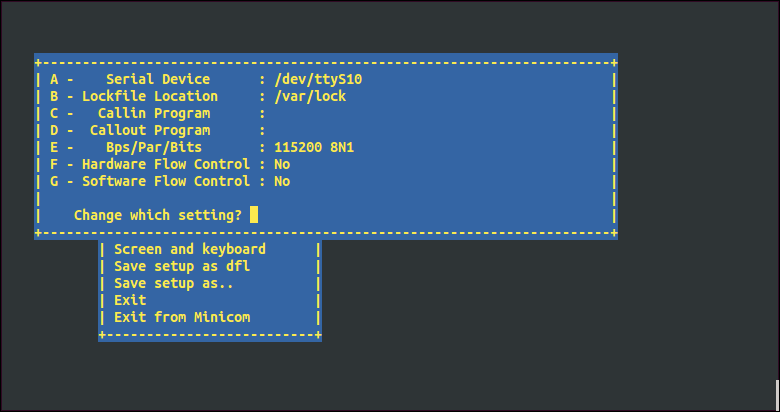
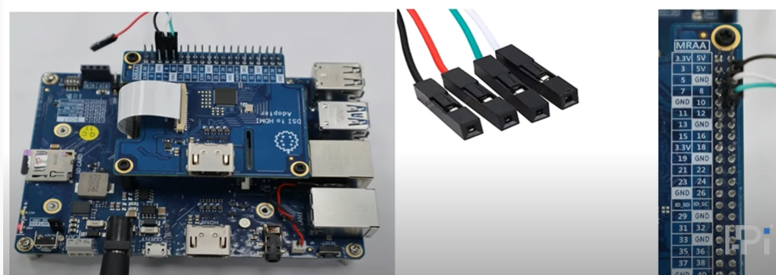
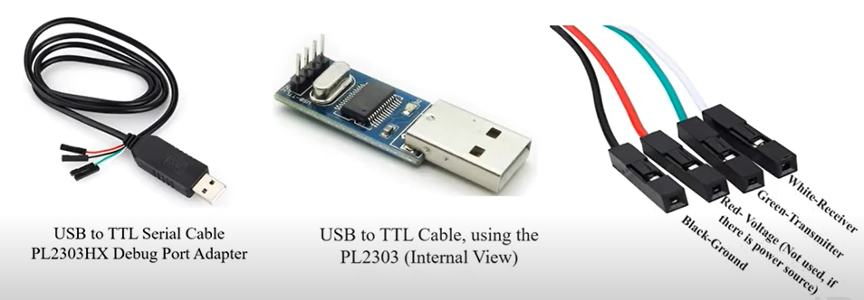

title: Tutorial 8 - how to enable Serial Communication
---


<div class="contentiframe">

<iframe  class="responsive-iframe"  width="640" height="480" src="https://www.youtube.com/embed/jE-Ddj8tc8I"  frameborder="0" allow="autoplay; encrypted-media" allowfullscreen></iframe>

</div>


### Using Ubutnu Hevelopment Host:

1. **minicom** is the popular program to talk to the external RS-232 devices. Please enter the following command to install it

    $ sudo apt-get install minicom

2. After installed, please execute this command to open this program

```
$ sudo minicom -s
```

3. Set up the serial port connection( **The default baud rate for serial port connections is 115200** ) and save it. 




### Using Windows Development Host

 Please download [**puTTY**](https://www.putty.org/) (**The default baud rate for serial port connections is 115200**)


<br>

## Serial port Connections



There are four wires: red-power, black-ground, white-RX into USB port, and green-TX out of the USB port

**Note:** The red wire is not connected to the voltage as I-Pi is already connected with the power source.


<br>

## PL2303HX Debug Port serial cable

 

* Single-chip USB to Serial (RS232/RS422/RS485) asynchronous serial data transfer interface
* Fully Compliant with USB Specification v2.0 (Full-Speed)
* USB-IF Logo Compliant with TID 40000100
* UHCI/OHCI (USB1.1), EHCI (USB 2.0), xHCI (USB 3.0) Host Controller Compatible
* Integrated USB 1.1 Transceiver and 5V to 3.3V Regulator
* Integrated 96MHz clock generator (No external crystal required)
* Integrated OTPROM (One-Time Programming ROM) – no external EEPROM required. 
* Supports USB to RS232 Serial UART Interface  
* Full-duplex transmitter and receiver (TXD and RXD).
* Supports RS-422/RS-485 like serial interface (TXD, DTR_N, and RTS_N pins should be externally pulled-up to 5V)
* Extensive Flow Control Mechanism
* Adjustable high/low watermark level 
* Automatic hardware flow control with CTS/RTS or DSR/DTR
* Automatic software flow control with XON/XOFF
* Inbound data buffer overflow detection
* Configurable 512-byte bi-directional data buffer 
* 256-byte outbound buffer and 256-byte inbound buffer
* 128-byte outbound buffer and 384-byte inbound buffer
* Supports Remote Wake-up from RS232 input pin signals (RI, RXD, DSR, DCD, CTS)
* Four (4) General Purpose I/O (GP0, GP1, GP2, & GP3) pins and Four (4) Auxiliary General Purpose I/O (RI_N, DSR_N, DCD_N, & CTS_N) pins.
* Supports Windows Selective Suspend by OTPROM configuration (Enable Remote Wakeup) 
* Suspends power of chip when idle (COM port is closed)
* Provides royalty-free USB to Virtual COM Port drivers for Windows, Mac, Linux, Android
* -40 C to 85s degrees C Operating Temperature
* Small footprint 28-pin SSOP or 32-pin QFN IC packages (RoHS compliant and Pb-free Green Compound


