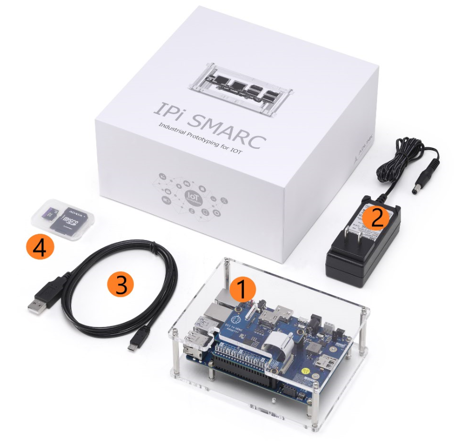

## What's Inside the Box

Before going to the setup or installation chapter please verify the contents of your package. Following items should be part of the kit. The standard set of I-Pi SMARC includes the following items:

1. Industrial I-Pi SMARC development kit containing the carrier and SMARC LEC-PX30 SoM pre-assembled in a chassis.  
2. d12Vdc /2A Power adapter with barrel connector (picture illustrates the US version, an EU version is also available).  
3. micro USB to Type A cable for OTG connection.  
4. micro-SD card with adapter (32 GB). 

 

**Watch our unboxing video to find out more:**

<iframe  class="responsive-iframe"    width="100%" height="480" src="https://www.youtube.com/embed/JqBQaoybEgU" frameborder="0" allow="autoplay; encrypted-media" allowfullscreen></iframe>

